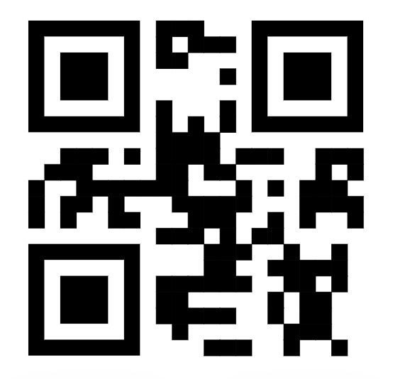

# AD282v - Master Mobile Application Development with Pro-Code Tools on SAP BTP

## Description
Accelerate development by using SAP Business Application Studio to consume a SAP Cloud Application Programming (CAP) Model service for mobile development. Build a native, cross-platform mobile application using the mobile development kit from SAP.

## Requirements
To complete the session exercises below, please first review the [pre-requisites](https://developers.sap.com/group.mobile-dev-kit-setup.html).

## Use Case

Build a Customer list from scratch based on an OData Service. Also, allow searching customers based on QR code and edit some of the fields on the mobile app.

## Exercises
| Exercise Number | Title                                           | Estimated Time (mins) |
| --------------- | -----------------------------------------------| ------------------- |
| [Exercise 1](https://developers.sap.com/group.mobile-dev-kit-setup.html) | Set Up for the Mobile Development Kit (MDK) | 20 |
| [Exercise 2](https://developers.sap.com/tutorials/cp-mobile-dev-kit-offline-app.html) | Start Your MDK Application in the Editor | 15 |
| [Exercise 3](https://developers.sap.com/tutorials/cp-mobile-dev-kit-list-page.html) | Create a Customer List Page in an MDK App    | 10 |
| [Exercise 4](https://developers.sap.com/tutorials/cp-mobile-dev-kit-detail-page.html) | Create a Customer Detail Page in an MDK App | 20 |
| [Exercise 5](https://developers.sap.com/tutorials/cp-mobile-dev-kit-edit-customer.html) | Modify a Customer Record in an MDK App | 25 |
| Optional Exercise ↓ |                                                 |                     |
| [Exercise 6](https://developers.sap.com/tutorials/cp-mobile-dev-kit-add-validation.html) | Define a Validation Rule in an MDK App | 10 |

## How to obtain support
Support for the content in this repository is available during the actual time of the online session for which this content has been designed. Otherwise, you may request support via the [Issues](../../issues) tab.

## Additional Support and Learning Resources
- Continue your learning with additional [MDK tutorials](https://help.sap.com/doc/f53c64b93e5140918d676b927a3cd65b/Cloud/en-US/docs-en/guides/getting-started/mdk/overview.html#tutorials) or [OpenSAP "SAP Mobile Experience"](https://open.sap.com/courses/mobile4).

- Check out the SAP Community for [Mobile Development](https://community.sap.com/topics/mobile-technology) & [Mobile Experience](https://community.sap.com/topics/mobile-experience).

- Central Start point for Developers is [Mobile Documentation](https://help.sap.com/doc/f53c64b93e5140918d676b927a3cd65b/Cloud/en-US/docs-en/index.html).
  
- Learn more about SAP Cloud Application Programming Model by [visiting the official documentation](https://cap.cloud.sap/docs/) and [with these additional resources](https://cap.cloud.sap/docs/resources/).

## License
Copyright (c) 2023 SAP SE or an SAP affiliate company. All rights reserved. This project is licensed under the Apache Software License, version 2.0, except as noted otherwise in the [LICENSE](LICENSES/Apache-2.0.txt) file.
