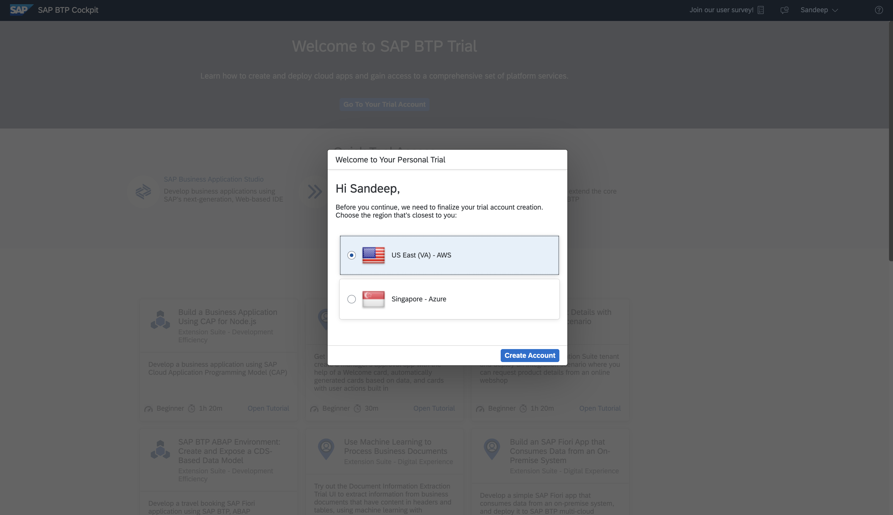
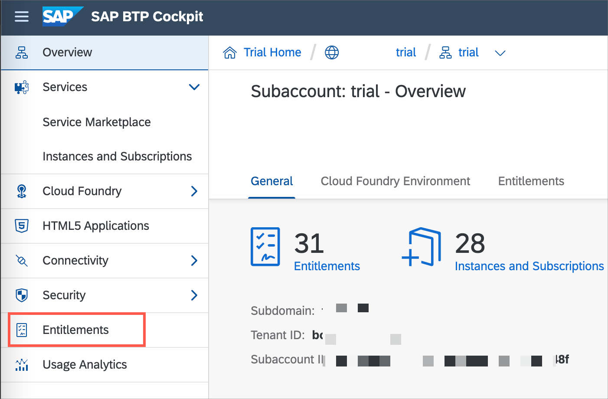
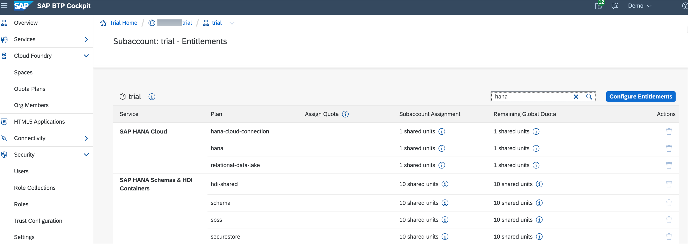

# Pre-Requisites

## Navigation
| Previous | Next |
| --- | --- |
| [Overview](../README.md) | [Exercise 1](../ex1/README.md) |

Before you begin with the session exercises, please ensure you have created your BTP subaccount in the **`US East (VA) - AWS [cf-us10]`** region.

## Index

| Pre-Requisite Step | Title                                                               | Estimated Time (mins) | Comments                                                                                 |
| ------------------ | ------------------------------------------------------------------- | --------------------- | ---------------------------------------------------------------------------------------- |
| 1                  | [Get a Free Account on SAP BTP Trial](https://developers.sap.com/tutorials/hcp-create-trial-account.html) | 15                    | Make sure you have created your subaccount in the `US East (VA) - AWS [cf-us10]` region |
| 2                  | [Add SAP HANA Cloud to your existing BTP trial](#add-sap-hana-cloud-to-your-existing-btp-trial)    | 15                    | Follow the provided guide if the entitlements are missing.                               |
| 3                  | [Set Up SAP Business Application Studio for Development](https://developers.sap.com/tutorials/appstudio-onboarding.html) | 10          | You will create two development spaces in upcoming exercises.                             |
| 4                  | [Access SAP Mobile Services](https://developers.sap.com/tutorials/fiori-ios-hcpms-setup.html)       | 5                     |                                                                                          |
| 5                  | [Download SAP Mobile Services Client on your mobile device](#download-sap-mobile-services-client-on-your-mobile-device) | 5           |                                                                                          |

### Add SAP HANA Cloud to your existing BTP trial

1. In the [SAP BTP trial account](https://account.hanatrial.ondemand.com/trial), navigate to your subaccount.

2. Click on **Entitlements** in the left-hand side menu.

    

3. Ensure you have entitlements for the services (and service plans) listed here:

    - SAP HANA Cloud: `hana-cloud-connection`, `hana`, and `relational-data-lake`
    - SAP HANA Schemas & HDI Containers: `hdi-shared`, `schema`, `sbss`, and `securestore`

    

4. If you **already have the required entitlements** added to your trial account,  follow the [**Provision an Instance of SAP HANA Cloud, SAP HANA Database tutorial**](https://developers.sap.com/tutorials/hana-cloud-mission-trial-3.html) on developers.sap.com. Since you won't need a Data Lake, you can **skip from option 6 onwards**.
    
    > If you do not have any of the entitlements above,follow the [**Start Using SAP HANA Cloud Trial in SAP BTP Cockpit tutorial**](https://developers.sap.com/tutorials/hana-cloud-mission-trial-2.html) on developers.sap.com.

[Back To Index](#index)

### Download SAP Mobile Services Client on your device

Download and install the *SAP Mobile Services Client* on your Android or iOS device.

Android             |  iOS
:-------------------------:|:-------------------------:
Scan the QR code below with your device to download the client from Google Play  | Scan the QR code below with your device to download the client from the App Store 

[Back To Index](#index)

## Summary

You have now completed the pre-requisites to get started with the session exercises.

## Navigation
| Previous | Next |
| --- | --- |
| [Overview](../README.md) | [Exercise 1](../ex1/README.md) |
