# Exercise 1 - Deploy Your SAP Cloud Application Programming Model Back-End Service

## Navigation
| Previous | Next |
| --- | --- |
| [Pre-Requisites](../ex0/README.md) | [Exercise 2](../ex2/README.md) |

## Objective
In this exercise, you'll learn how to deploy a back-end built using SAP Cloud Application Programming Model using SAP HANA Cloud to your BTP Trial account.

## Estimated Time
:clock4: 20 minutes

## Exercise
| Sub Exercise | Title | Estimated Time (mins) |
| --------------- | ----- | ------------------- |
| [Exercise 1.1](#exercise-11---set-up-sap-business-application-studio-for-full-stack-development) | Set Up SAP Business Application Studio for Full Stack Development | 4 |
| [Exercise 1.2](#exercise-12---configure-cloud-foundry-on-sap-business-application-studio) | Configure Cloud Foundry on SAP Business Application Studio | 4 |
| [Exercise 1.3](#exercise-13---deploy-cloud-application-programming-model) | Deploy the first version of your mobile app | 10 |
| [Exercise 1.4](#exercise-14---explore-back-end-service) | Explore Back-End Service | 2 |

### Exercise 1.1 - Set Up SAP Business Application Studio for Full Stack Development

1. Open SAP Business Application Studio in your SAP BTP Trial Account.

    

2. Select Full Stack Cloud Application and create a new Dev Space named `Full_Stack_Dev`.

    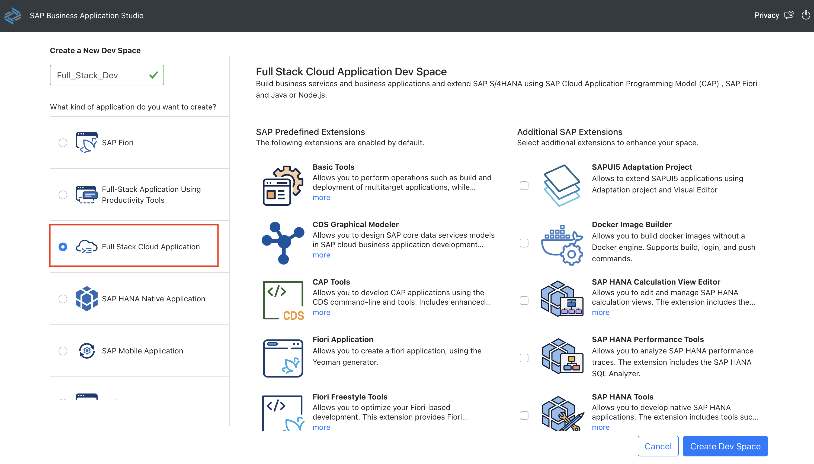

3. Enter your Dev Space once the status changes to `RUNNING`.

    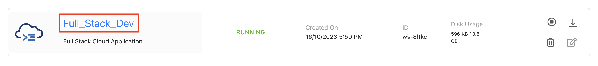

4. Click "Clone from Git".

    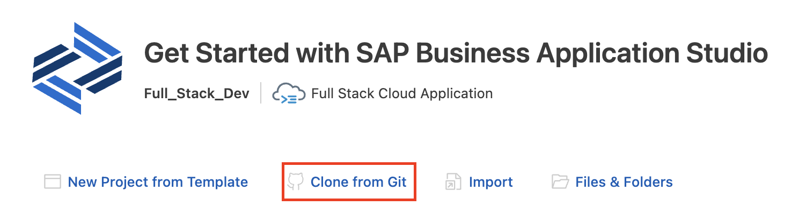

5. Enter URL [https://github.com/SAP-samples/teched2023-AD282v](https://github.com/SAP-samples/teched2023-AD282v).

   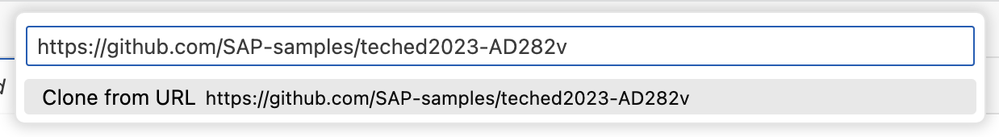

6. Open Project Folder teched2023-AD282v &rarr; ex1 &rarr; cap-backend

    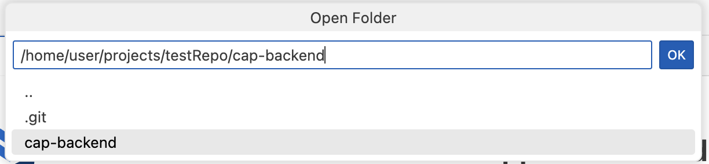

### Exercise 1.2 - Configure Cloud Foundry on SAP Business Application Studio

1. Initiate the CF Login Command.

    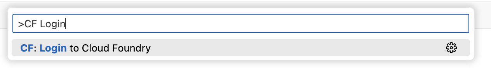

2. Select the SSO Passcode radio button.

3. Click "Open a new browser page to generate your SSO passcode".

    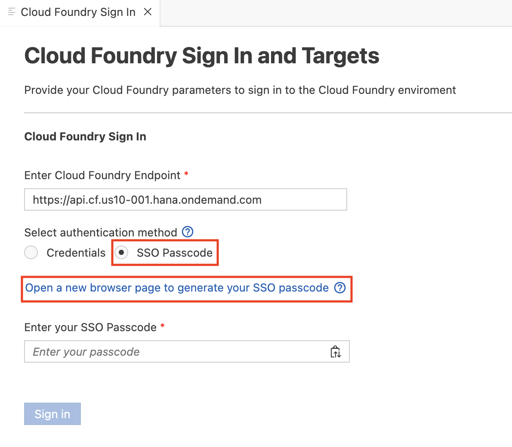

4. Copy the Temporary Authentication Code.

    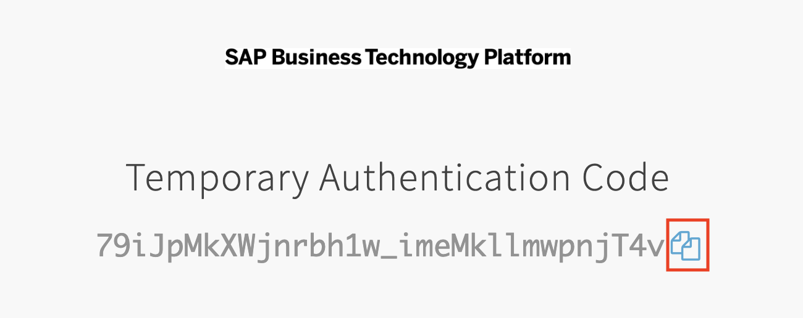

5. Paste the Temporary Authentication Code in the Passcode input box and click "Sign in".

    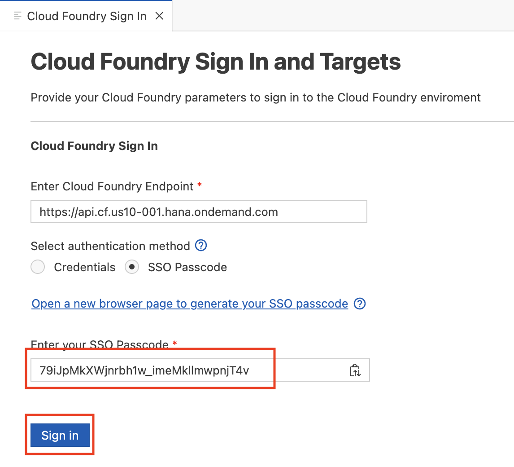

6. Select the Organization & Space and click "Apply".

    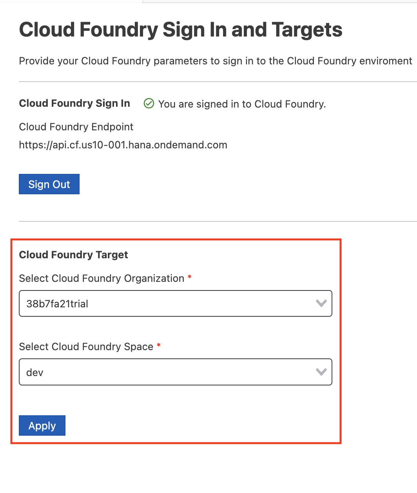

### Exercise 1.3 - Deploy Cloud Application Programming Model

1. Start a new Terminal.

    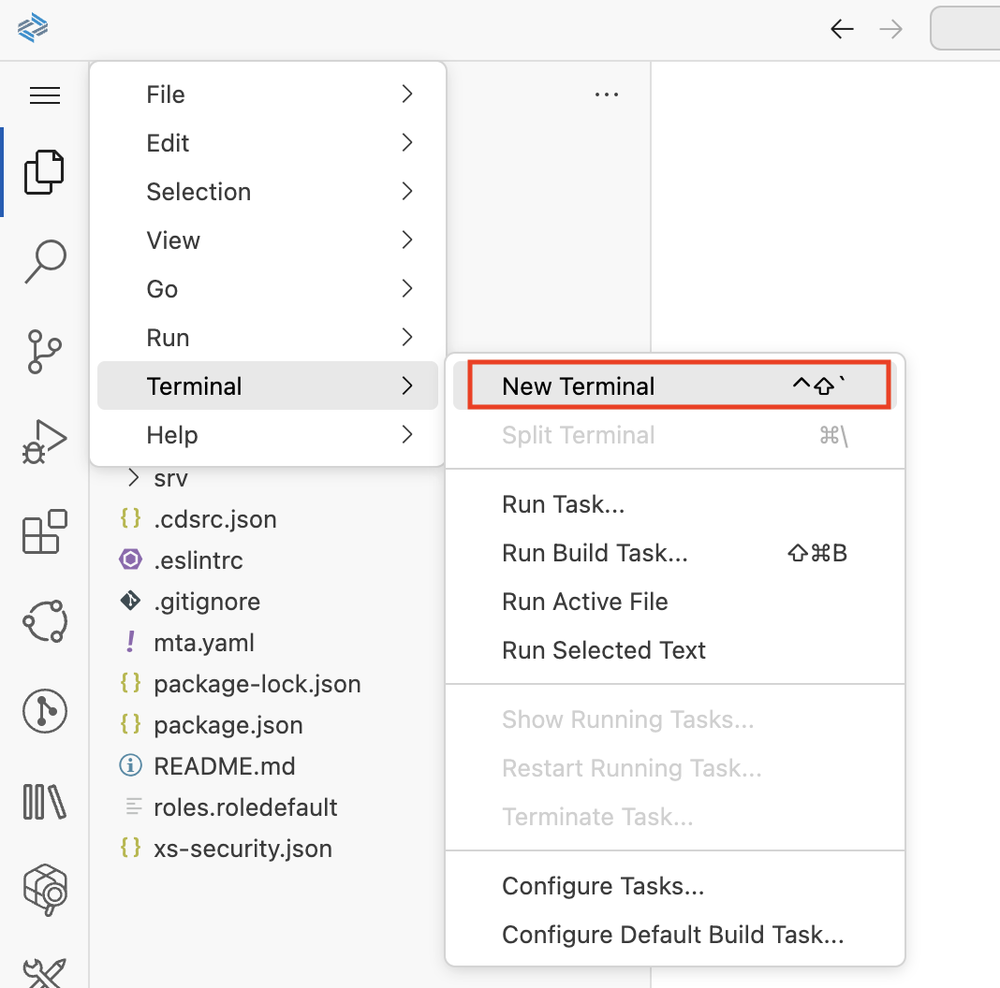

2. Run `npm install`.

    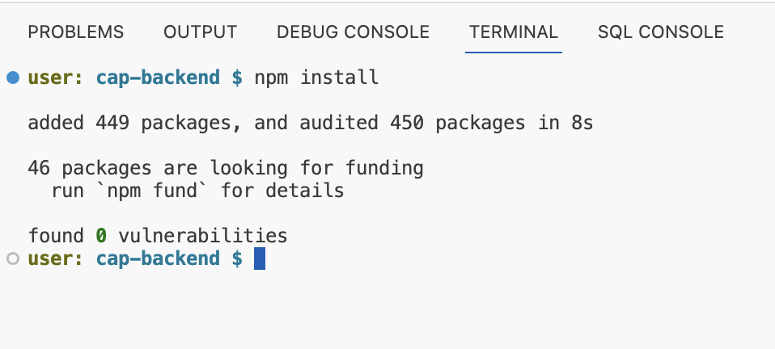

    > Make sure you are in the `cap-backend` folder.

3. Run `mbt build`.

    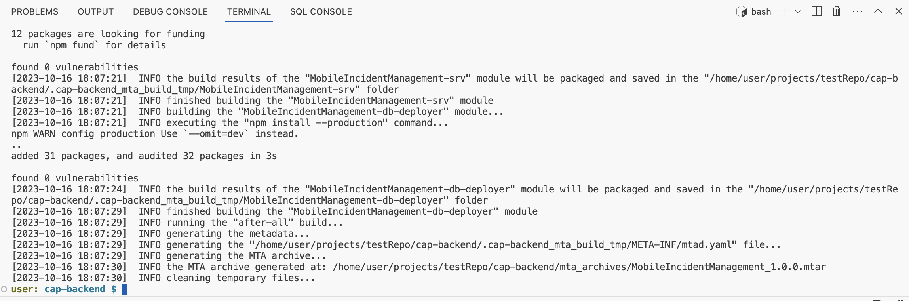

4. Run `cf deploy mta_archives/MobileIncidentManagement_1.0.0.mtar`.

    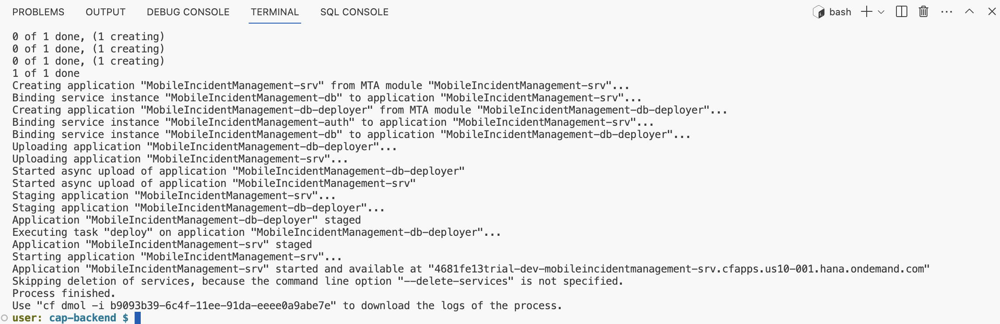

    > If needed, you can delete the service using `cf undeploy MobileIncidentManagement --delete-services --delete-service-keys --delete-service-brokers -f`.

### Exercise 1.4 - Explore Back-End Service

1. Go to the space where you deployed the SAP Cloud Application Programming Model service on your BTP Trial account.

    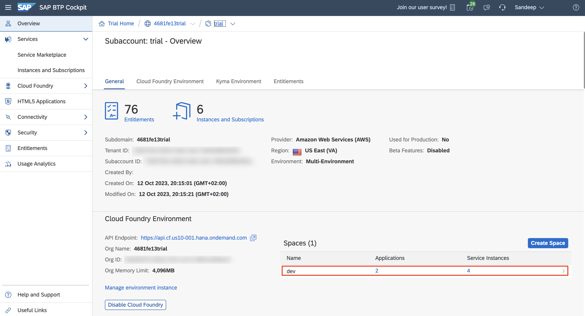

2. Click `MobileIncidentManagement-srv`.

    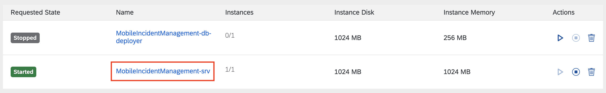

3. Click `$metadata` to view the metadata of the service.

    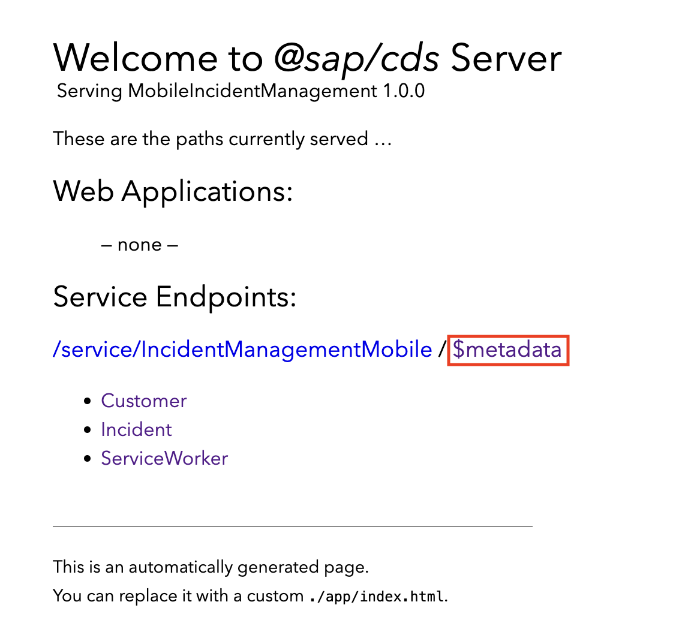

4. Append the relative path of the URL to view the list of Incidents - `/service/IncidentManagementMobile/Incident`.

    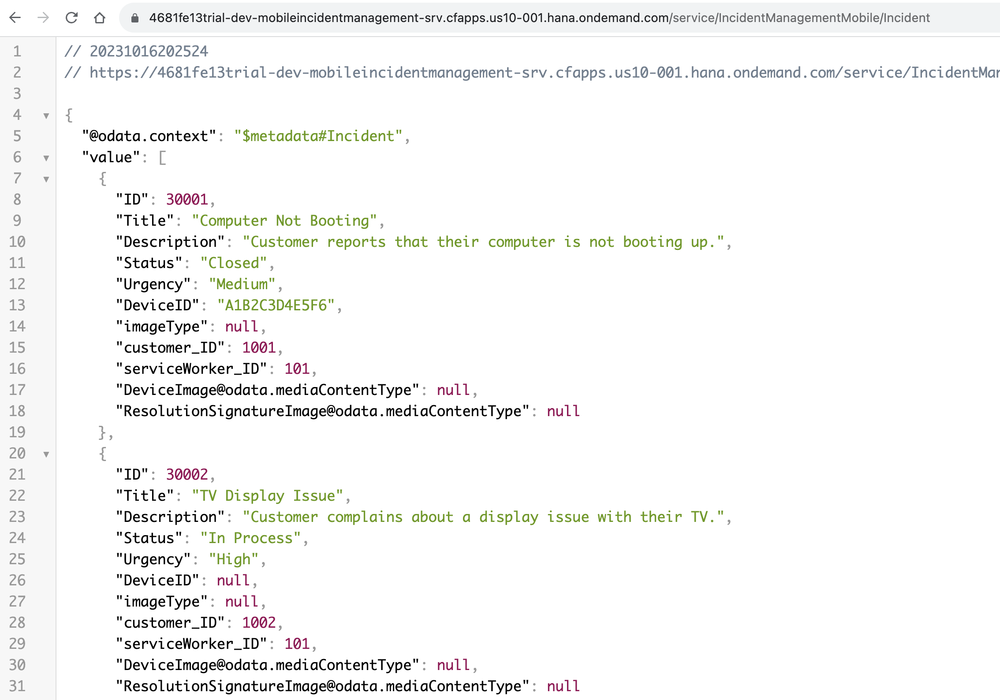

## Summary

You've completed the exercise to deploy your SAP Cloud Application Programming Model back-end service.

## Navigation

| Previous | Next |
| --- | --- |
| [Pre-Requisites](../ex0/README.md) | [Exercise 2](../ex2/README.md) |
