# Exercise 1 - Deploy your SAP Cloud Application Programming Model back-end service

## Navigation
| Previous| Next |
|---|---|
| [Pre-Requisites](../ex0/README.md) |  | 
| [Overview](../README.md) | [Exercise 2](../ex2/README.md) |

## Objective
In this exercise you'll learn how to deploy a back-end built using SAP Cloud Application Programming Model using SAP HANA Cloud to your BTP Trial account.

## Estimated time
:clock4: 15 minutes

## Exercise

### Exercise 1.1 - Setup SAP Business Application Studio for Full Stack Development

1. Open SAP Business Application Studio, on your SAP BTP Trial Account 
   
    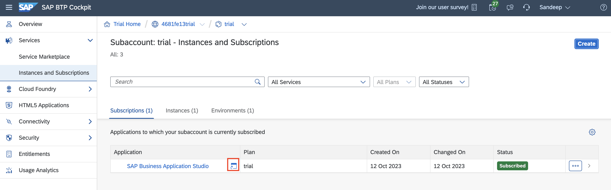

2. Select Full Stack Cloud Application, and Create a New Dev Space with the name `Full_Stack_Dev`.

    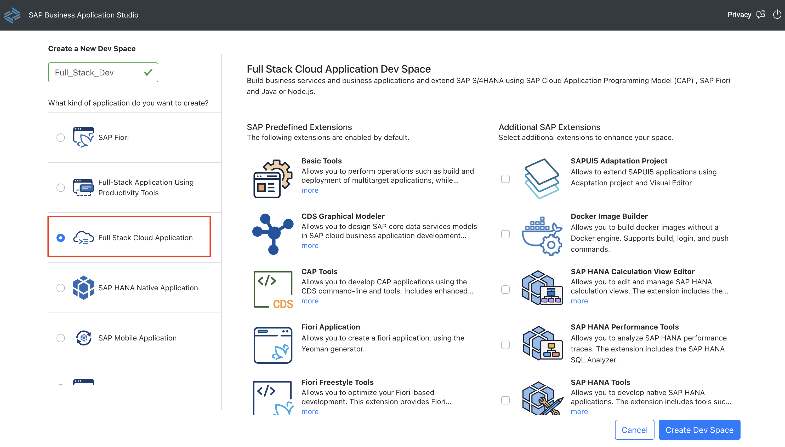

3. Enter your dev space, once the status changes to `RUNNING``.

    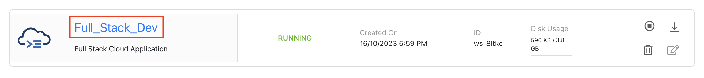

4. Click Clone from Git

    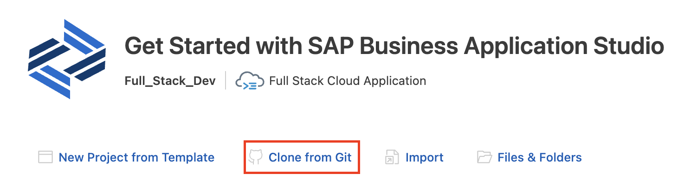

5. Enter URL https://github.com/SAP-samples/teched2023-AD282v
   
   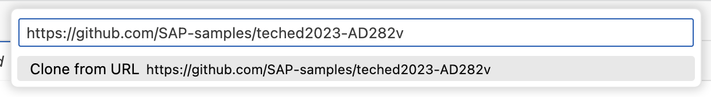

6. Open Project Folder teched2023-AD282v &rarr; ex1 &rarr; cap-backend

    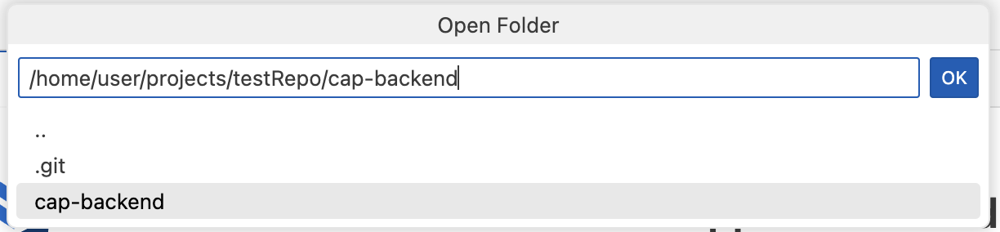

### Exercise 1.2 - Configure Cloud Foundry on SAP Business Application Studio

1. Initate CF Login Command

    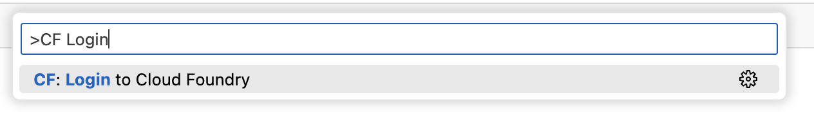

2. Select SSO Passcode radio button.

3. Click **Open a new browser page to generate your SSO passcode**

    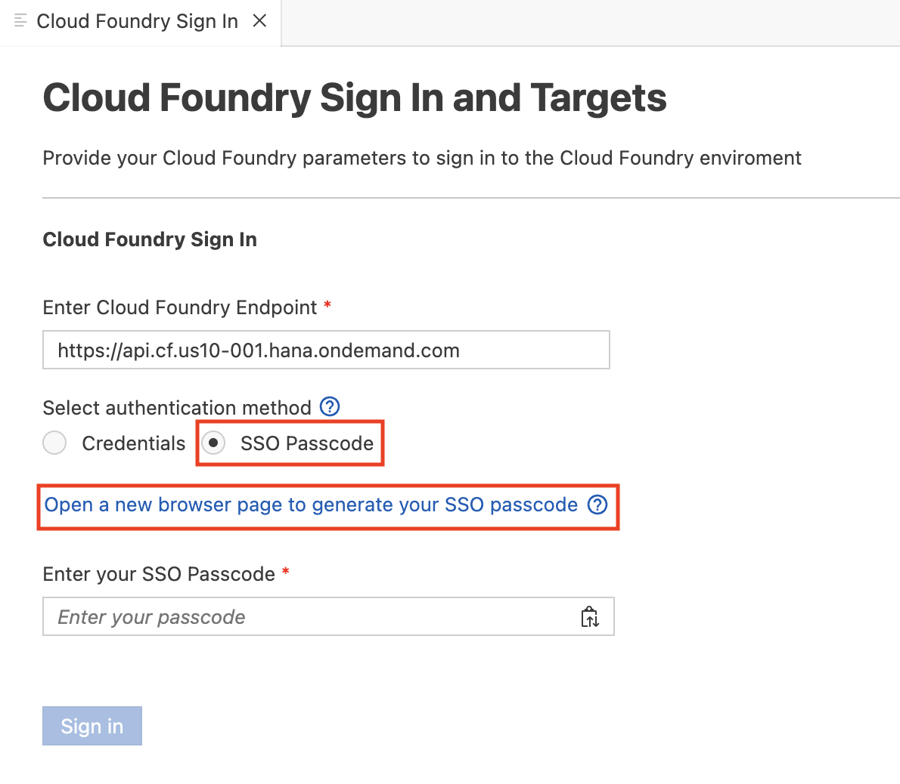

4. Copy the Temporary Authentication Code

    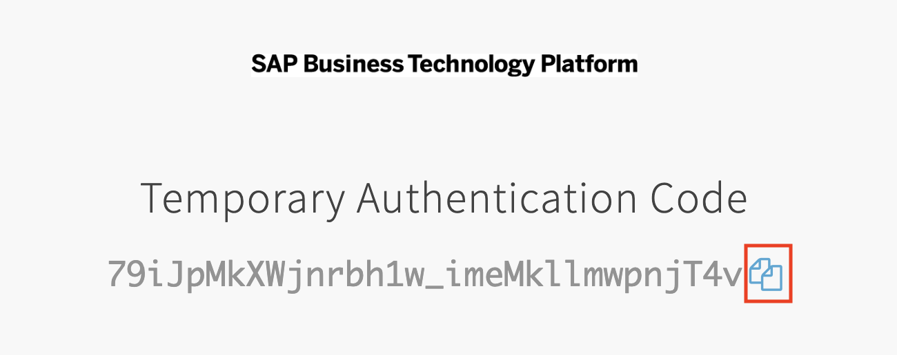

5. Paste the Temporary Authentication Code in the Passcode input box, and click Sign in.

    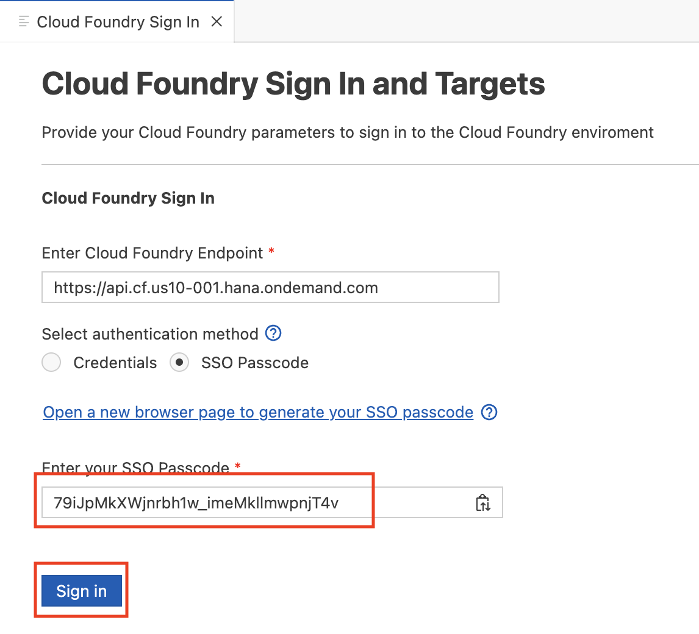

6. Select the Organization & Space and click Apply.

    

### Exercise 1.3 - Deploy Cloud Application Programming Model

1. Start a new Terminal.

    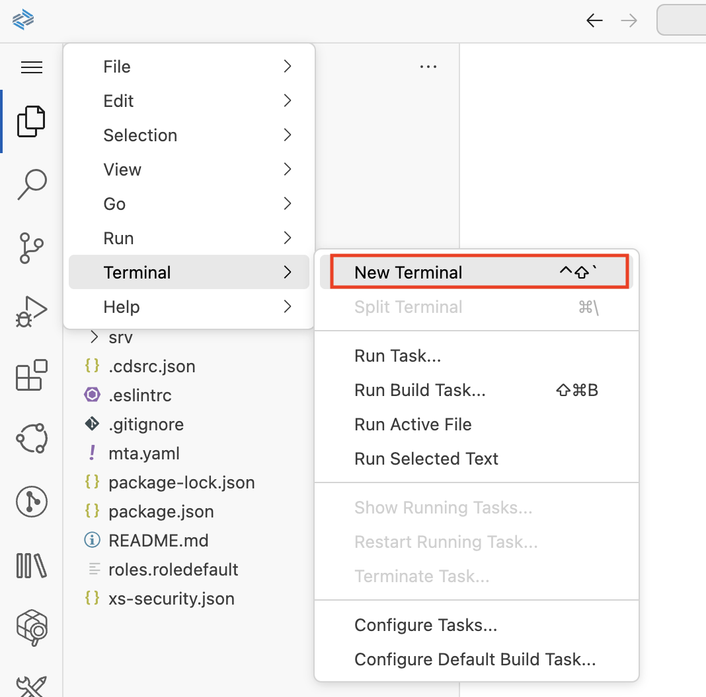

2. Run `npm install`.

    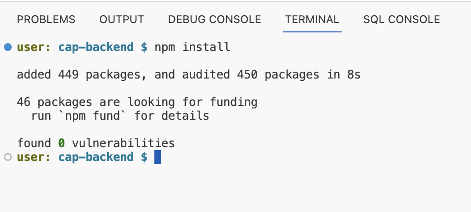

    > Ensure that you are running the command in the `cap-backend` folder.

3. Run `mbt build`.

    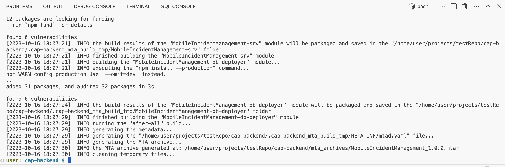

4.  Run `cf deploy mta_archives/MobileIncidentManagement_1.0.0.mtar`.

    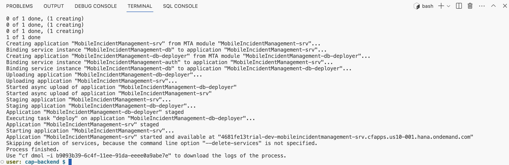

    > If for some reason you need to delete the service, the best way would be to run `cf undeploy MobileIncidentManagement --delete-services --delete-service-keys --delete-service-brokers -f`.

### Exercise 1.4 - Explore Back-end Service

1. Go to the space where you deployed the SAP Cloud Application Programming Model service on your BTP Trial account.

    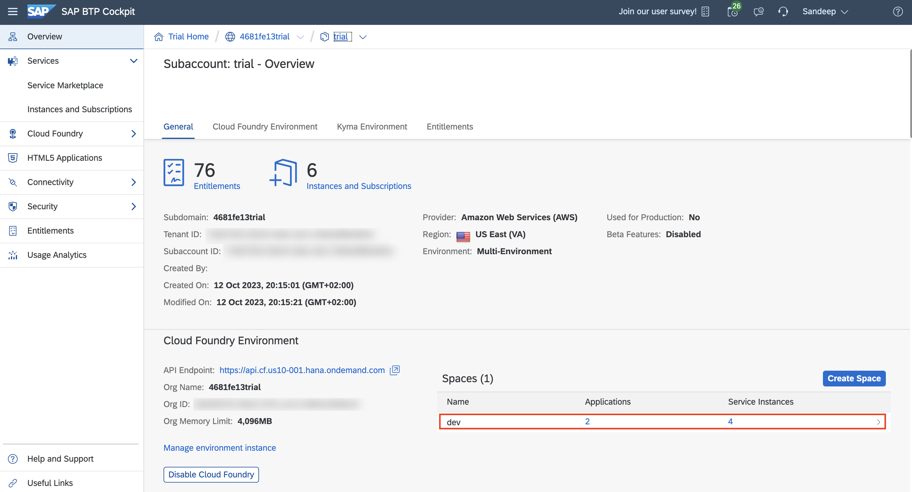

2. Click `MobileIncidenetManagement-srv` 

    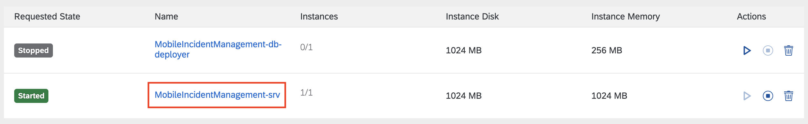

3. Click `$metadata` to view the metadata of the service.

    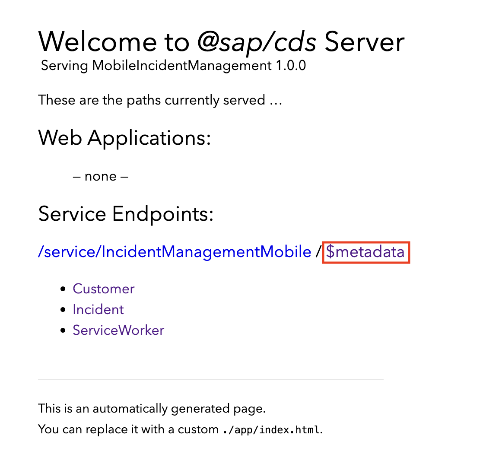

4. Append the relative path of the URL to view the list of Incidents - `/service/IncidentManagementMobile/Incident`

    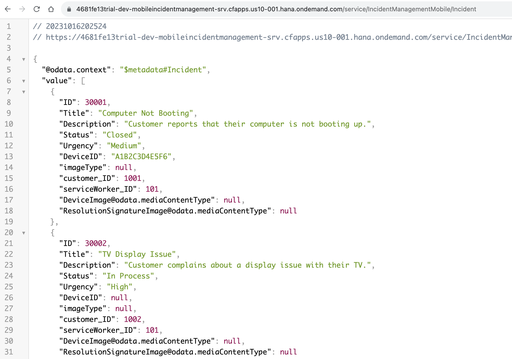

## Summary

## Navigation

| Previous| Next |
|---|---|
| [Pre-Requisites](../ex0/README.md) |  | 
| [Overview](../README.md) | [Exercise 2](../ex2/README.md) |
