# Exercise 2 - Configure Your Back-End on SAP Mobile Services

## Navigation
| Previous | Next |
| --- | --- |
| [Exercise 1](../ex1/README.md) | [Exercise 3](../ex3/README.md) |

## Objective
This exercise will guide you through configuring your back-end using SAP Mobile Services.

## Estimated Time
:clock4: 15 minutes

## Exercise
| Sub-Exercise Number | Title | Estimated Time (mins) |
| ------------------- | ----- | ------------------- |
| [Exercise 2.1](#exercise-21---create-mobile-services-server-side-application) | Create Mobile Services Server Side Application | 6 |
| [Exercise 2.2](#exercise-22---add-your-back-end-service-as-a-destination) | Add Your Back-End Service as a Destination | 4 |
| [Exercise 2.3](#exercise-23---set-up-your-mobile-development-space-in-sap-business-application-studio) | Set Up Your Mobile Development Space in SAP Business Application Studio | 5 |

### Exercise 2.1 - Create Mobile Services Server Side Application

1. Open the Mobile Services Admin UI in your SAP BTP Trial Account.

    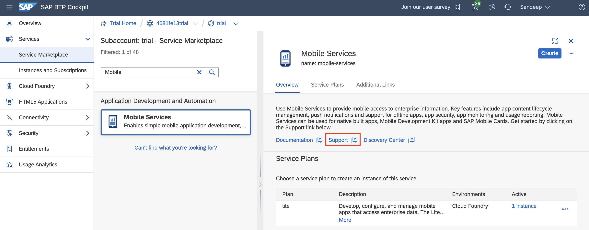

2. Click "Create New App" on the Home Screen.

    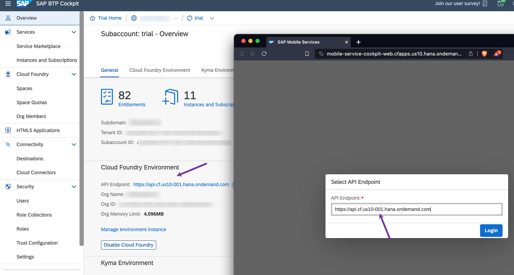

3. In the Basic Info step of the New Application Wizard, enter the following details and click "Next":
   - ID: `com.sap.mdk.demo`
   - Name: `SAP MDK Demo App`

    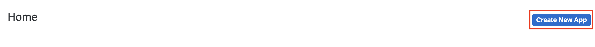

4. Keep the default settings in the Security Settings step and click "Next".

5. Disable Role Settings in the Role Settings step and click "Next".

6. In the Assign Features step, select "Mobile Development Kit Application" from the dropdown and click "Finish".

    > You can ignore any pop-ups and proceed by clicking "OK".

### Exercise 2.2 - Add Your Back-End Service as a Destination

1. Click "Mobile Connectivity" under the Assigned Features section in the Info Tab.

    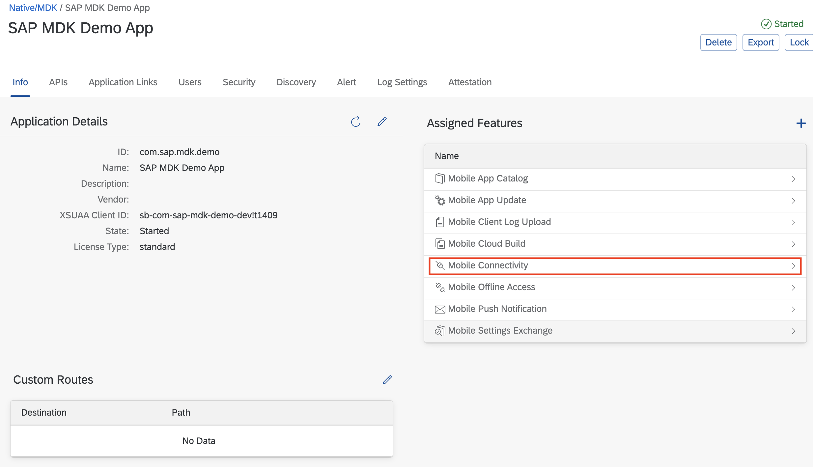

2. Click the create icon.

    

3. In the Basic Info step of the Create Destination Wizard, enter the following details and click "Next":
   - ID: `cap.incident.management`
   - Name: `<Domain>/service/IncidentManagementMobile`

    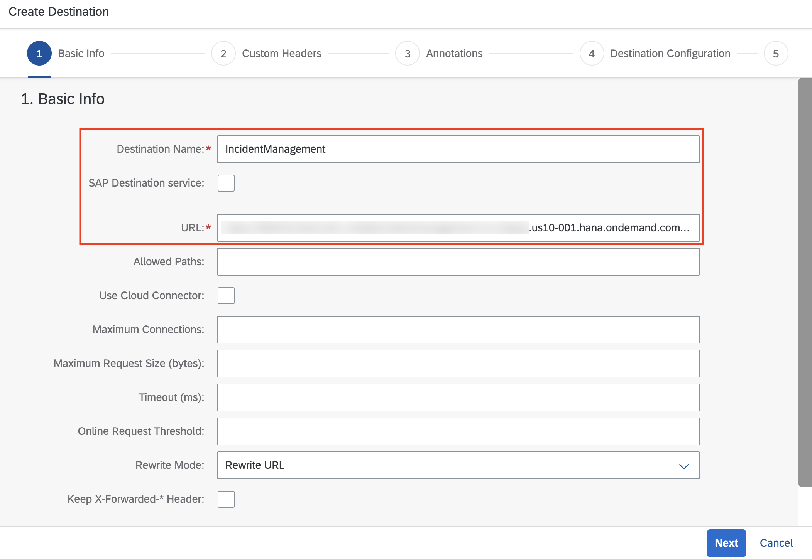

4. Keep the default settings in the Annotations step and click "Next".

5. Keep the default settings in the Destination Configuration step and click "Next".

6. Keep the default settings in the Certificate Configuration step and click "Finish".

7. Select "Mobile Connectivity" in the breadcrumb menu.

    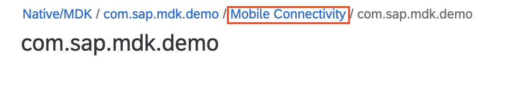

8. Click the OData Application Destination Test action for the newly created destination.

    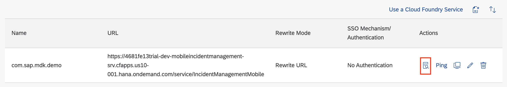

9. Change the Metadata Entity Set to "Incident" and view the data.

    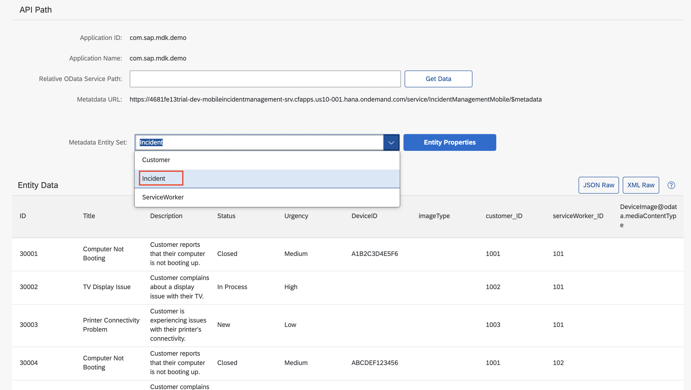

### Exercise 2.3 - Set Up Your Mobile Development Space in SAP Business Application Studio

1. Open SAP Business Application Studio in your SAP BTP Trial Account.

    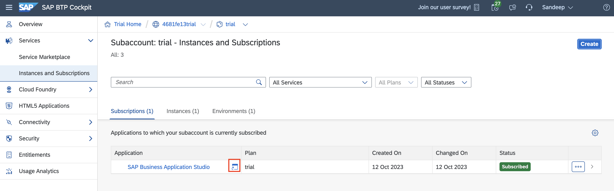

2. Select "SAP Mobile Application" and create a new Dev Space named `Mobile_Dev`.

    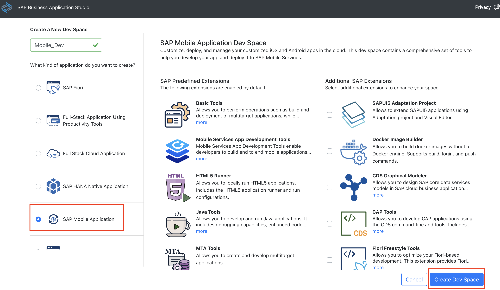

3. Enter your Dev Space once the status changes to "RUNNING".

    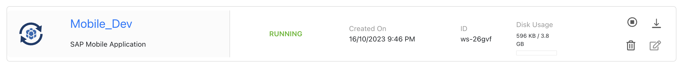

    > Stop the `Full_Stack_Dev` space and start the `Mobile_Dev` space since you are allowed a total of 2 dev spaces, with only 1 running at a time.

4. Click "Clone from Git".

    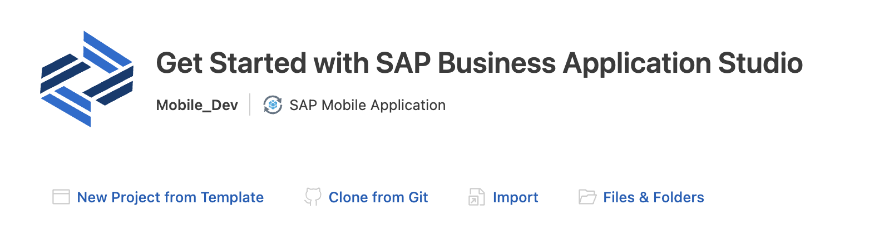

5. Enter URL [https://github.com/SAP-samples/teched2023-AD282v](https://github.com/SAP-samples/teched2023-AD282v).

   

6. Open Project Folder `teched2023-AD282v` &rarr; `ex2` &rarr; `MDKApp`

    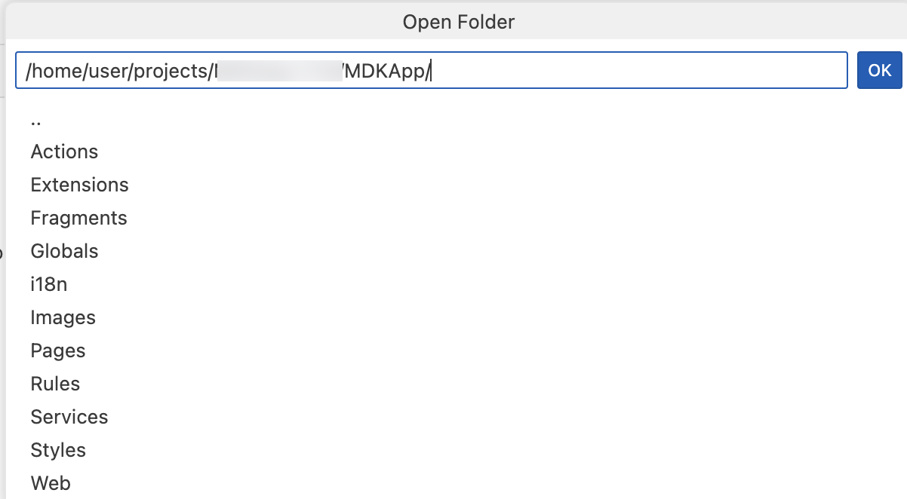

## Summary

[Add summary here]

## Navigation

| Previous | Next |
| --- | --- |
| [Exercise 1](../ex1/README.md) | [Exercise 3](../ex3/README.md) |
