# Exercise 3 - Run the Starting Application on Your Device

## Navigation
| Previous| Next |
|---|---|
| [Exercise 2](../ex2/README.md) | [Exercise 4](../ex4/README.md) | 

## Objective
In this exercise, you will run a starting SAP Mobile Development Kit (MDK) application on your device.

## Estimated time
:clock4: 10 minutes

## Index
| Exercise Number | Exercise Description                                                   |
|-----------------|-----------------------------------------------------------------------|
| 3.1             | [Display the QR code for onboarding the Mobile app](#exercise-31---display-the-qr-code-for-onboarding-the-mobile-app) |
| 3.2             | [Run the app](#exercise-32---run-the-app) |

### Exercise 3.1 - Display the QR code for onboarding the Mobile app

1. Click the `Application.app` to open it in MDK Application Editor and then click the **Application QR Code** icon.

    

2. If prompted with an `Alert` window, dismiss it by clicking on **OK**. 

    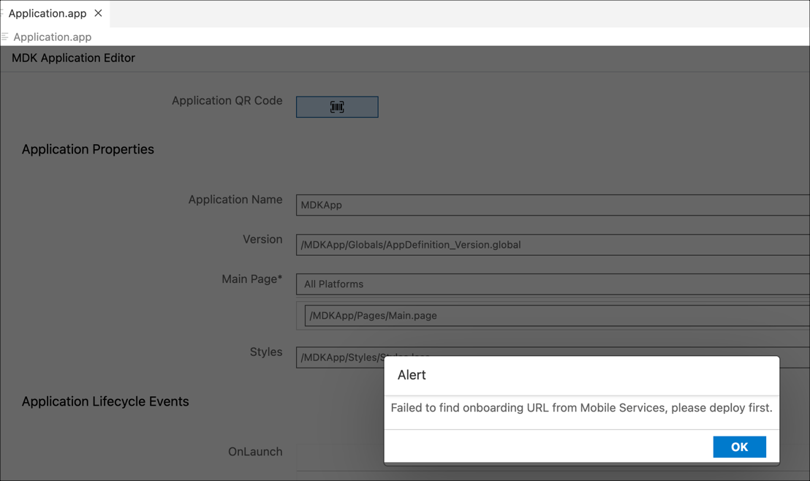

3. If you don't have an active CF session, you may be prompted to log into Cloud Foundry. If prompted, click **Login** to continue. If not, proceed directly to step 10-.

    

4. Choose the **SSO Passcode** as your authentication method, then click on the highlighted hyperlink. This will open a new browser page.

    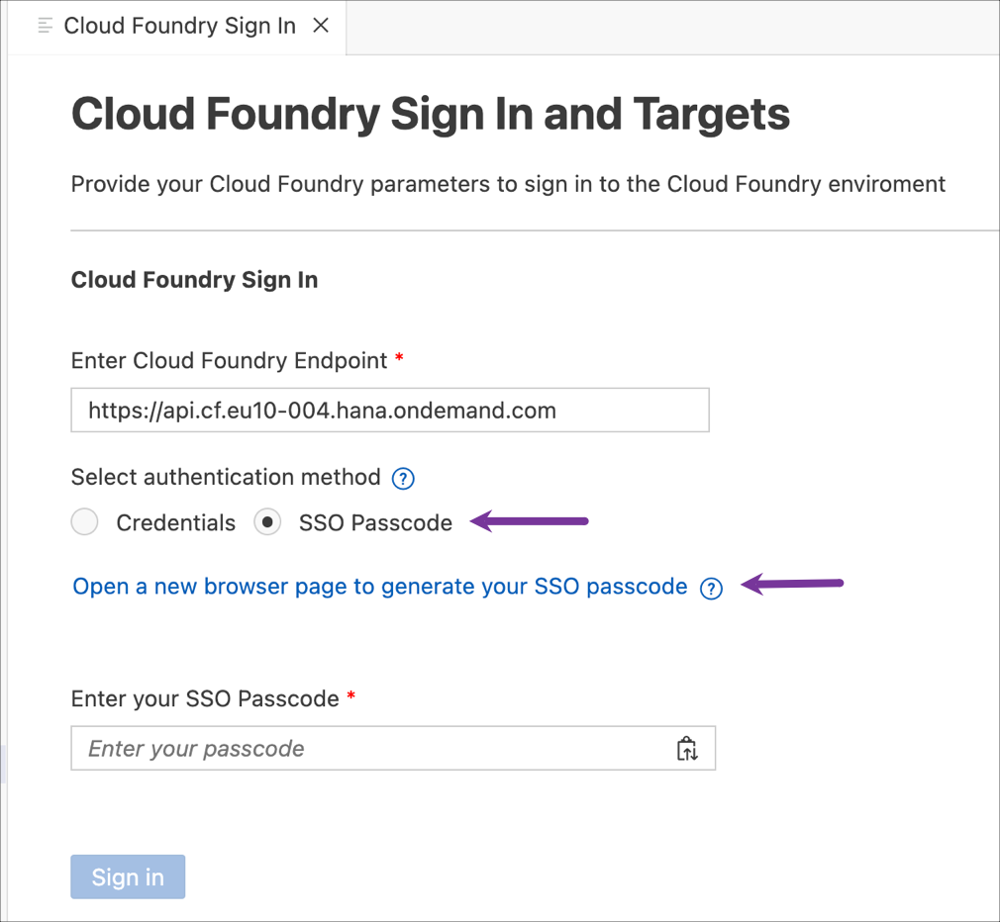

5. Copy the Temporary Authentication Code.

    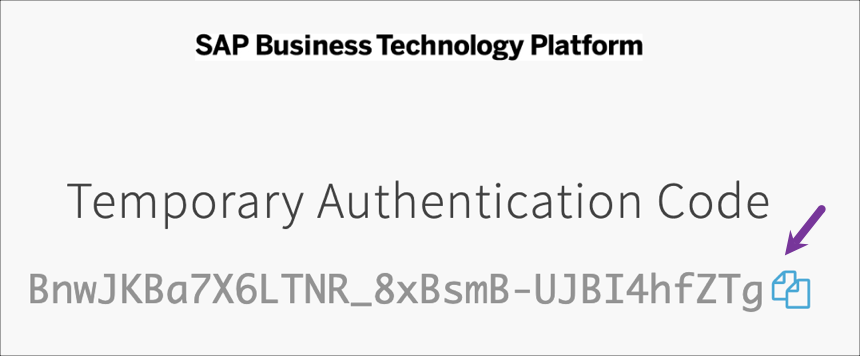

6. Switch back to the SAP Business Application Studio page. Paste the copied code into the field labeled **Enter your SSO Passcode** and then click **Sign In**.

    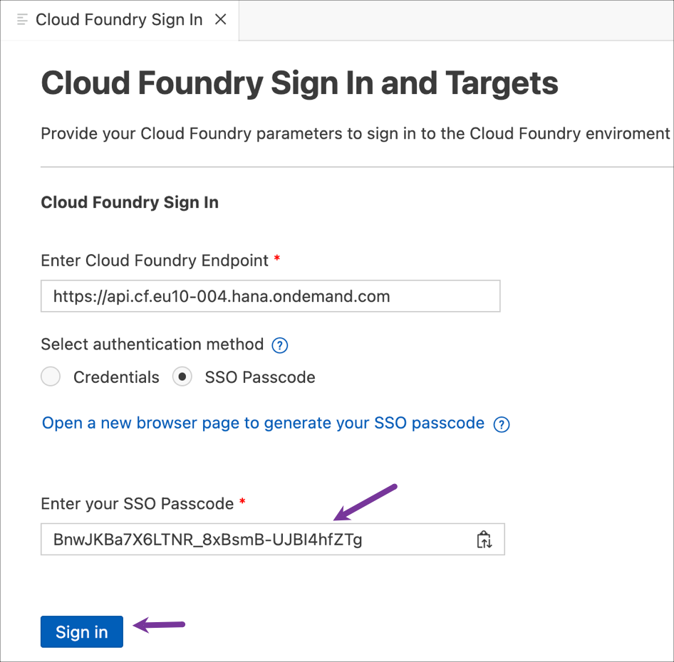

7. You are now signed in to the Cloud Foundry. Set the Cloud Foundry target by choosing the appropriate Organization and space from the dropdown menu and then click on **Apply**.

    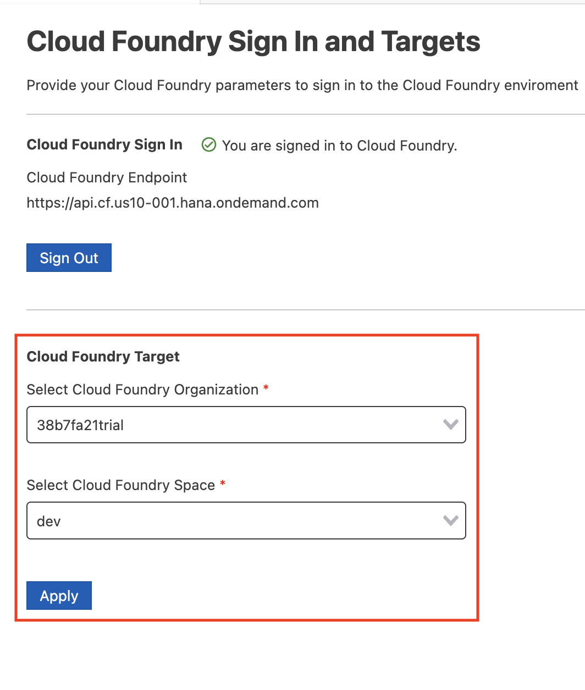

8. Once the Cloud Foundry target is set, the `Cloud Foundry Sign in` tab will automatically close. Click on the QR code icon again.

9. Select standard to deploy the app to SAP Mobile Services.

    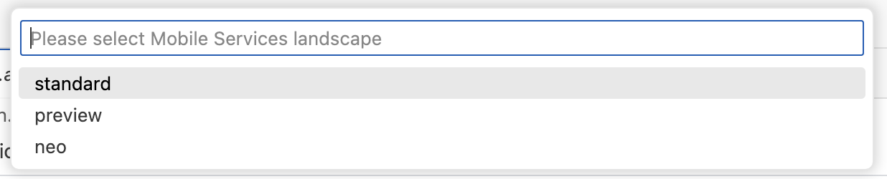

10. Select the server side application you created in the previous exercise, e.g. `com.sap.mdk.demo`.

    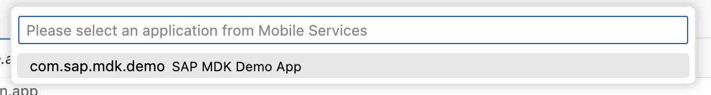

11. The On-boarding QR code is now displayed. Leave the Onboarding dialog box open as you proceed to the next step.

    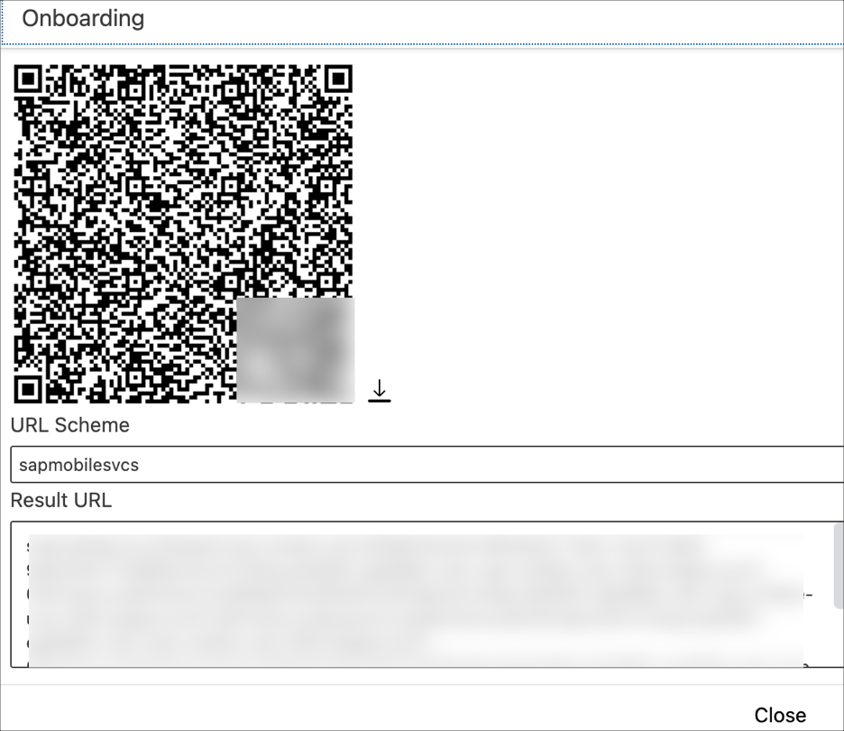

### Exercise 3.2 - Run the app
| Steps      | Android | iOS     |
| :---:        |    :----:   |  :---: |
| 1. Launch **`Mobile Svcs`** app on your mobile device. Tap **Agree** on `End User License Agreement and Privacy Statement`.      | 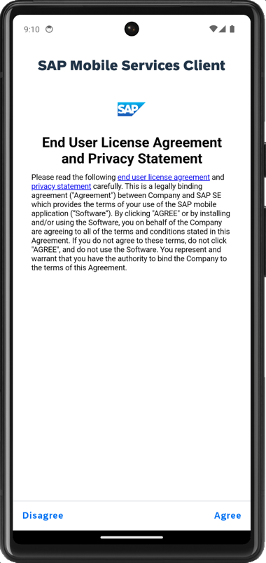       | 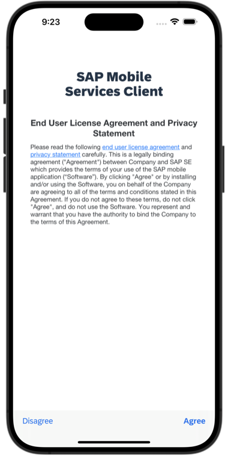   |
| 2. Tap **Scan** to start the device camera for scanning the onboarding QR code and grant permission to access the camera. Please note, if you already have the MDK client on-boarded, tap *Get Started* and *Scan new QR code* to continue.  | 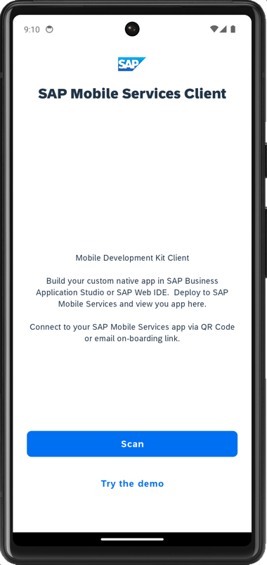       | 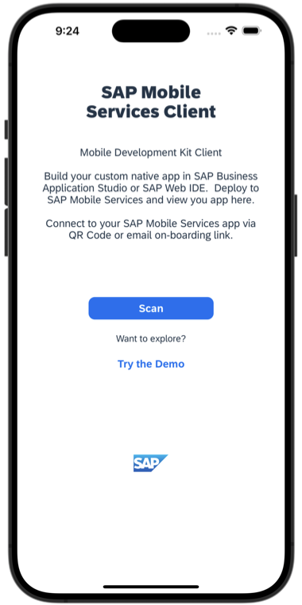   |
| 3. Once scan is succeeded, tap **Continue**.   | 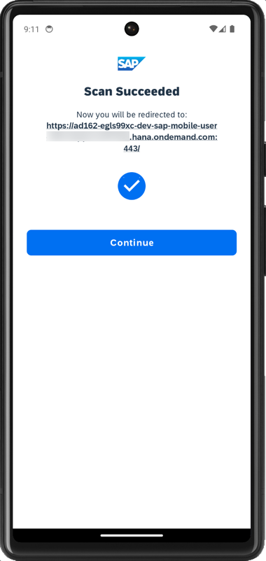       | 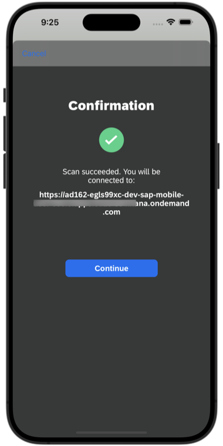   |
| 4. Please use the login credentials that were shared with you during the session to log into SAP BTP.  | 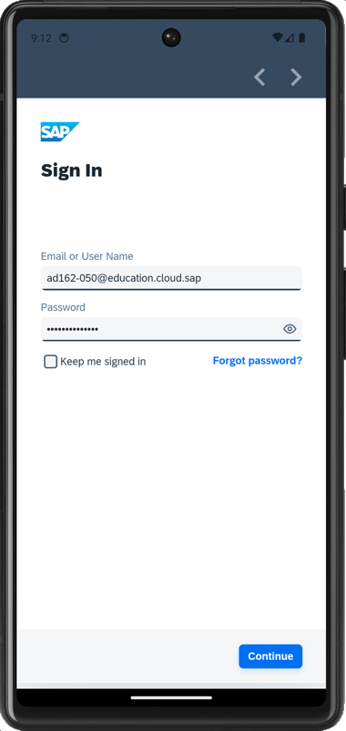     | 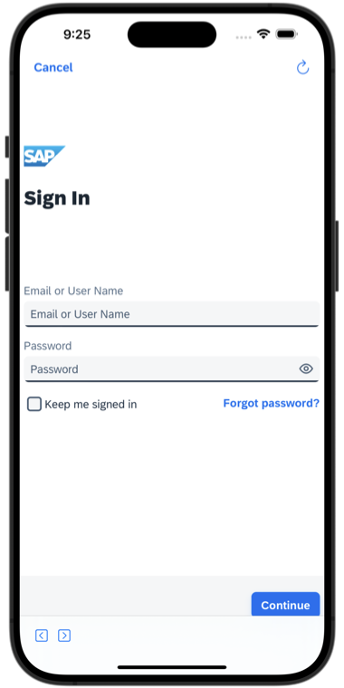  |
| 5. Create a passcode that is at least 5 characters long to unlock the app, and then tap **Next**.   | 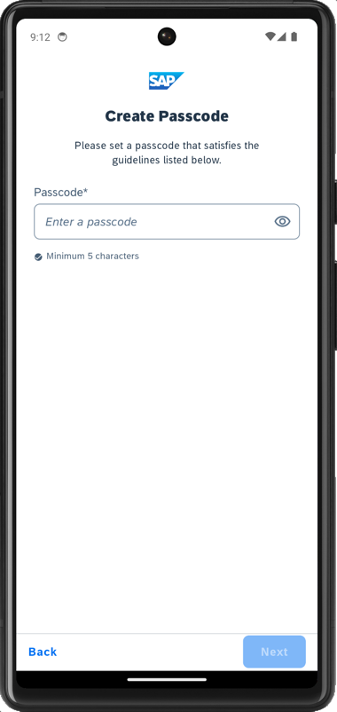       | 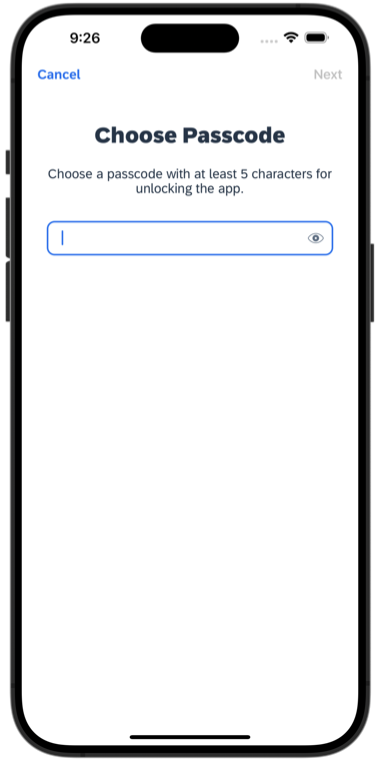   |
| 6. Confirm the passcode and tap **Done**.   | 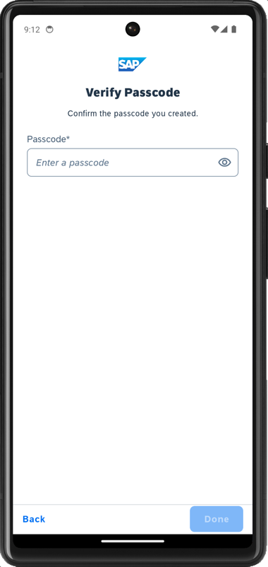       | 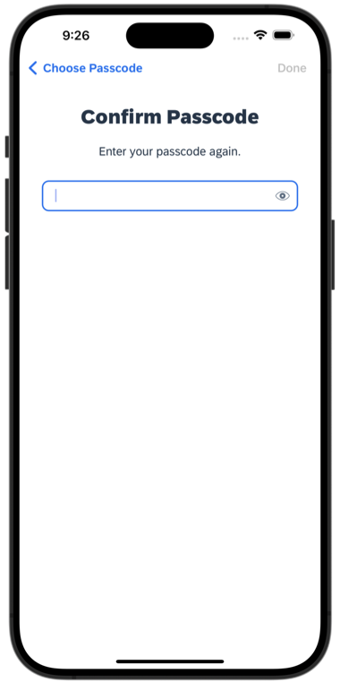   |
| 7. You have the option to enable Biometric Authentication for faster access to app data. Tap **Enable** if you wish to use this feature.  | 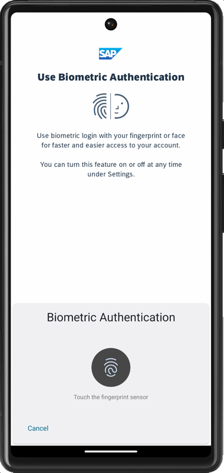       | 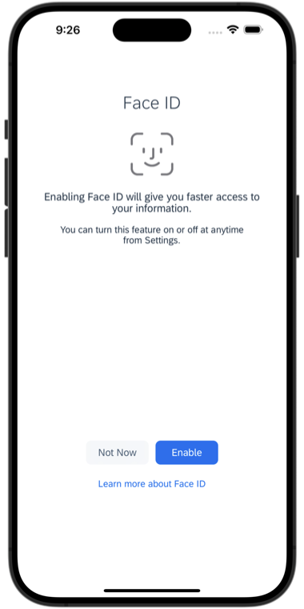   |
| 8. If you want your MDK client to send you notifications, click Next.  | 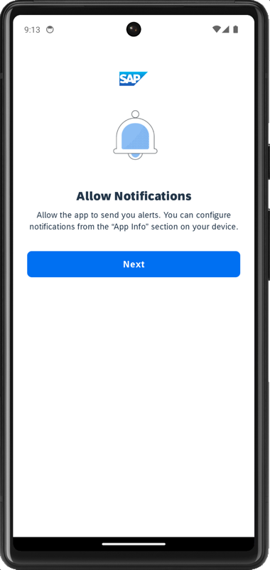       | NA |
| 9. Tap on **Now** to accept the deployed metadata definitions.   | 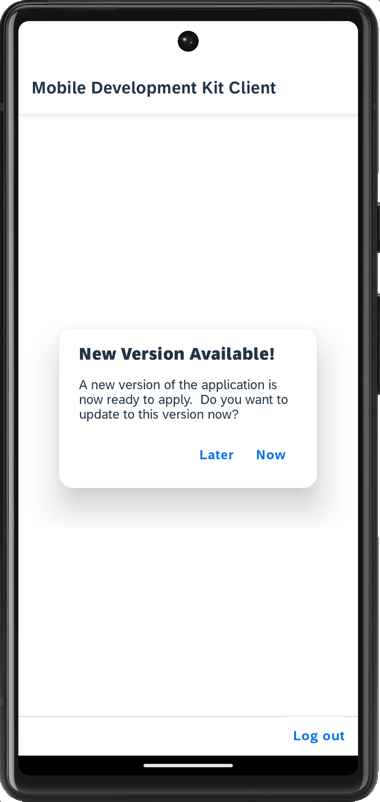       |    |
| 10. After accepting the app update, the offline store will initialize. You'll see a list of incidents assigned to you and a user menu section on the main page. The User Menu includes the following items.   **Sync Changes:** This allows you to upload any local changes from the Mobile client to the backend and download any delta changes from the backend to the Mobile client.   **Support:** This provides an easy way for users to contact support via a contact cell. The contact information is defined in the global settings.  The Activity Log option on the Support page allows the user to toggle client logging on or off, set the log level, and, if enabled in the Mobile Services application, upload the current client logs.  **Check for Updates:** This checks if new Metadata has been deployed to the Mobile Services App Update. If new Metadata is found, it will be downloaded and prompt the user to apply the changes.  **About:** This page displays the current user/device ID, Application Name, Metadata version, and Client version information.  **Logout:**	This completely resets the client, erasing any downloaded data and application Metadata, and returns the user to the license agreement screen.     | 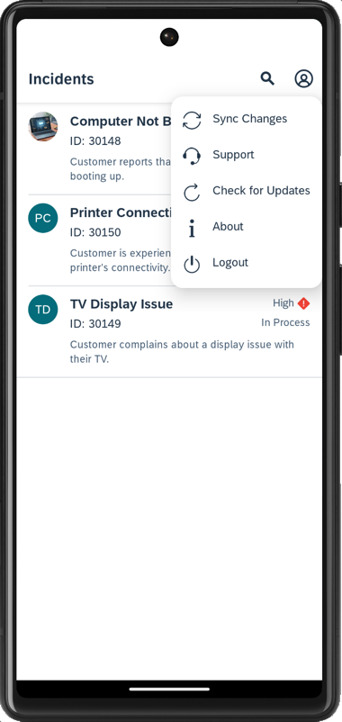       | 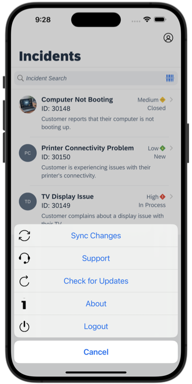   |
| 11. Tap on any of the incidents to navigate to the detail page, where you'll find more information about the incident. You can also access the customer's address via a maps application. | 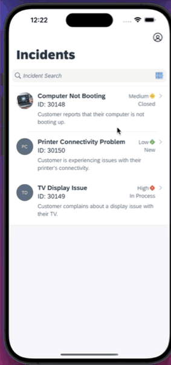       | 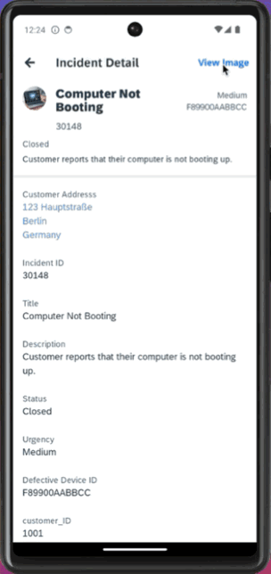   |

>After scanning and onboarding using the URL, it will be remembered. If you log out and onboard again, you'll be prompted to either continue using the current application or to scan a new QR code.

## Summary
You now have the starting application running in your MDK client.

## Navigation
| Previous| Next |
|---|---|
| [Exercise 2](../ex2/README.md) | [Exercise 4](../ex4/README.md) | 
