# Exercise 4 - Enhance the generated Incidents List and Detail page

## Navigation
| Previous| Next |
|---|---|
| [Exercise 3](../ex3/README.md) | [Exercise 5](../ex5/README.md) | 

## Objective
In this exercise, you'll make few enhancements to the generated Incidents list. First, you'll display the customer's name. Then, you'll add a Filter feedback bar that will appear above the Incident List to filter incidents based on certain criteria.

Next, you'll make enhancements to the Incident detail page. Here, you'll replace the existing Object Header with a Profile Header. This enhancement will provide additional information and improved access to multiple communication methods with a customer.

## Estimated time
:clock4: 20 minutes

## Index
| Exercise Number | Exercise Description                                                   |
|-----------------|-----------------------------------------------------------------------|
| 3.1             | [Display Customer Name and add a Filter Feedback Bar on the Incident List page](#exercise-31---display-customer-name-and-add-a-filter-feedback-bar-on-the-incident-list-page) |
| 3.2             | [Add a Filter Feedback Bar on the Incident List page](#exercise-32---add-a-filter-feedback-bar-on-the-incident-list-page) |
| 3.3             | [Replace the existing Object Header with Profile Header UI control](#exercise-33---replace-the-existing-object-header-with-profile-header-ui-control) |
| 3.4             | [Redeploy the application](#exercise-34---redeploy-the-application)    |
| 3.5             | [Update the MDK app with new metadata](#exercise-35---update-the-mdk-app-with-new-metadata) |

### Exercise 3.1 - Display Customer Name and add a Filter Feedback Bar on the Incident List page
As a technician, you may want to see who reported an incident without navigating to the detail page. You may also want to filter the incident list based on status (like new or in process) and urgency (like high).

1. The Incident entity has a `customer` navigation property defined in the OData service definition that allows accessing customer information. 

    To find the service definition, navigate to `Services` | `.IncidentManagement.xml` in your MDK metadata project. You will use this `customer` navigation property to access a customer's details.
   
    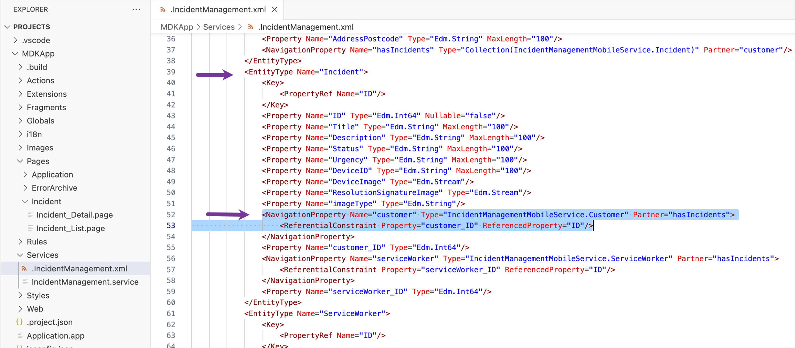

2. The `customer` navigation property has already been defined in the Incidents list page. This information can be found by navigating to `Pages` | `Incident` | `Incident_List.page`. Select the Object Table control to find the  `QueryOptions` property binding.

    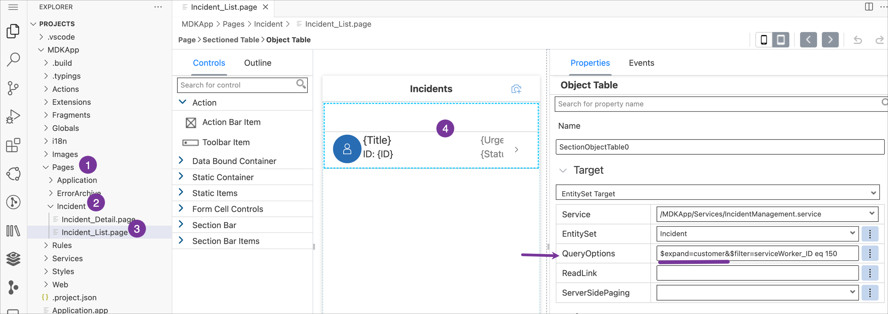

3. Scroll down through the Object Table properties, then click on the link icon next to the **Footnote** property to open the Object browser.
    * Manually type `Reported by` in the Expression field, followed by a space.
    * In the search field, look for the customer's first name, select `FirstName` and click on `Insert`. The expression box will generate the binding `Reported by {customer/FirstName}` **Don't close the Object Browser window**.
    * Add a space after the generated value.
    * Look for the customer's last name in the search field, select `LastName` and click  `Insert`. The expression box will generate the binding `Reported by {customer/FirstName} {customer/LastName}`. 
    * Click **OK** to set this value in the control field.

    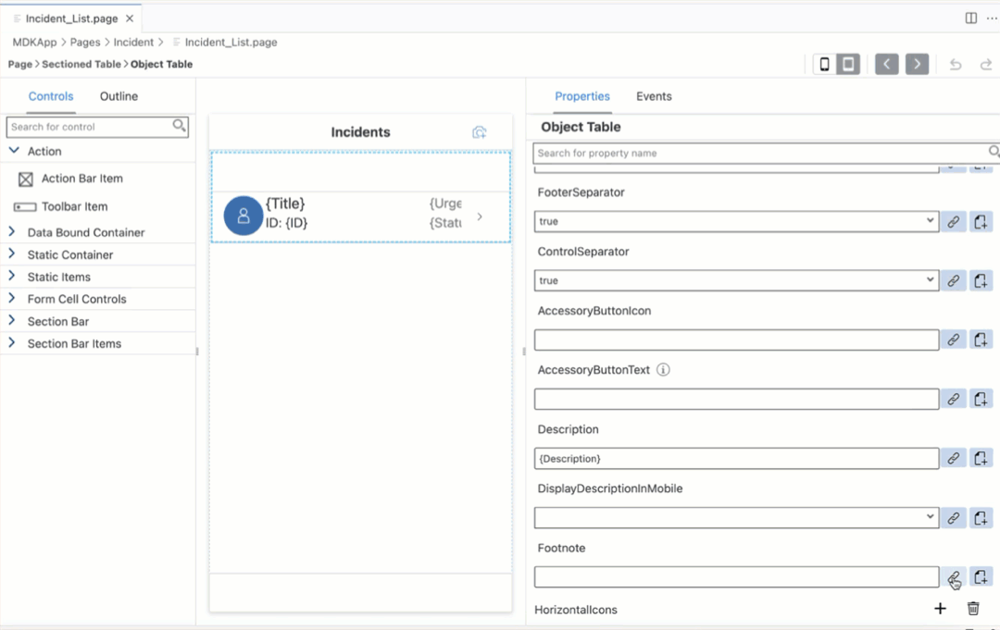

### Exercise 3.2 - Add a Filter Feedback Bar on the Incident List page
A Filter feedback bar is a horizontal bar that appears above a content list (on a Sectioned Table). It uses area interactive chips to indicate which filters have been applied to the list, and enable users to rapidly apply frequently-used filters.

1. In the `Incident_List.page`, navigate to the highlighted `Sectioned Table`.

    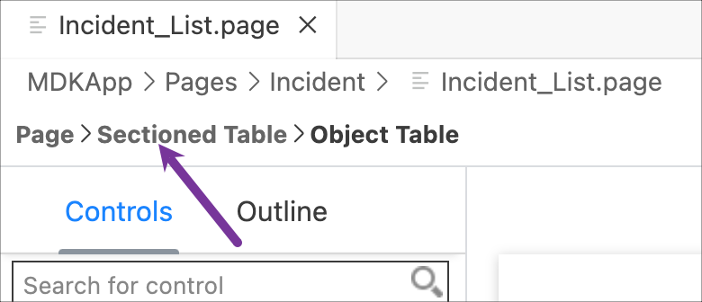

2. In the Property pane, select **Object Collection** for the `FastFilters` property under **FilterFeebackBar** section.

    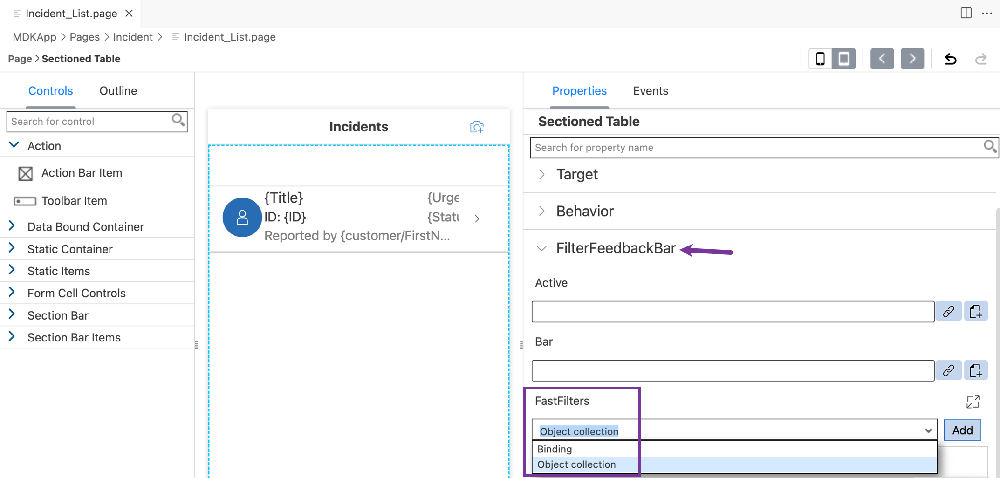

3. Click **Add**. You will see an `item0` object generated. Expand it to view its properties.

    

4. Fill in the following information:

    | Property | Value |
    |----|----|
    | `DisplayValue` | `High Priority` |
    | `FilterType` | Choose `Filter` from the dropdown |
    | `ReturnValue` | `Urgency eq 'High'` |    

    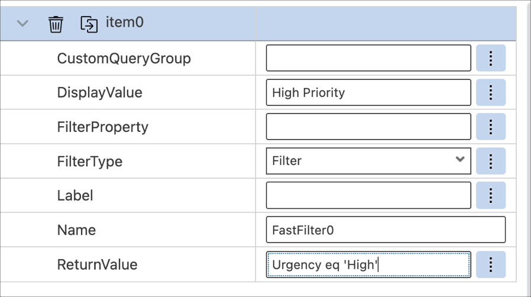    

5. Add another item to the `FastFilters` and fill in the following information: 

    | Property | Value |
    |----|----|
    | `DisplayValue` | `Open Status` |
    | `FilterType` | Choose `Filter` from the dropdown |    
    | `ReturnValue` | `Status eq 'New' or Status eq 'In Process'` |    

    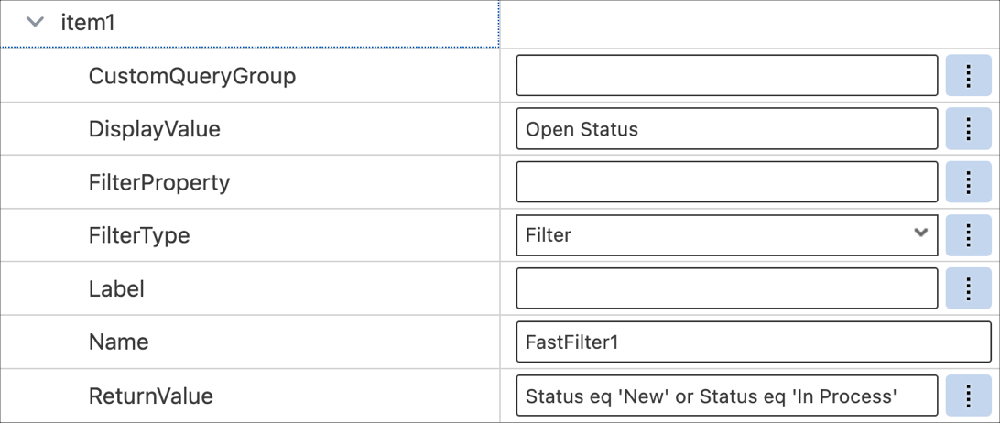   

6. Set **true** for `ShowAllFilters` property, if it's not already set.

    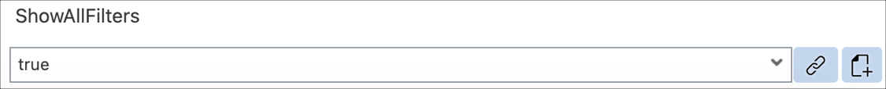 

### Exercise 3.3 - Replace the existing Object Header with Profile Header UI control
A Profile header UI control furnishes additional information and enhances access to various communication methods with a customer.

1. Navigate to `Pages` | `Incident` | `Incident_Detail.page`. Update the page's `DesignTimeTarget`'s `QueryOptions` to access  Customer information at design time. Click on the three-dot icons to open the Object Browser for the `QueryOptions` property.

    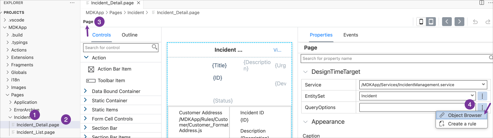 

    >The `DesignTimeTarget` property is similar to Target, but is only used for design time.  

2. Select the `customer` expand property, you'll notice that the expression value updates accrodingly. Click **OK** to close the Query Options Expression Editor. You can now access and bind customer information to any control on the detail page.

    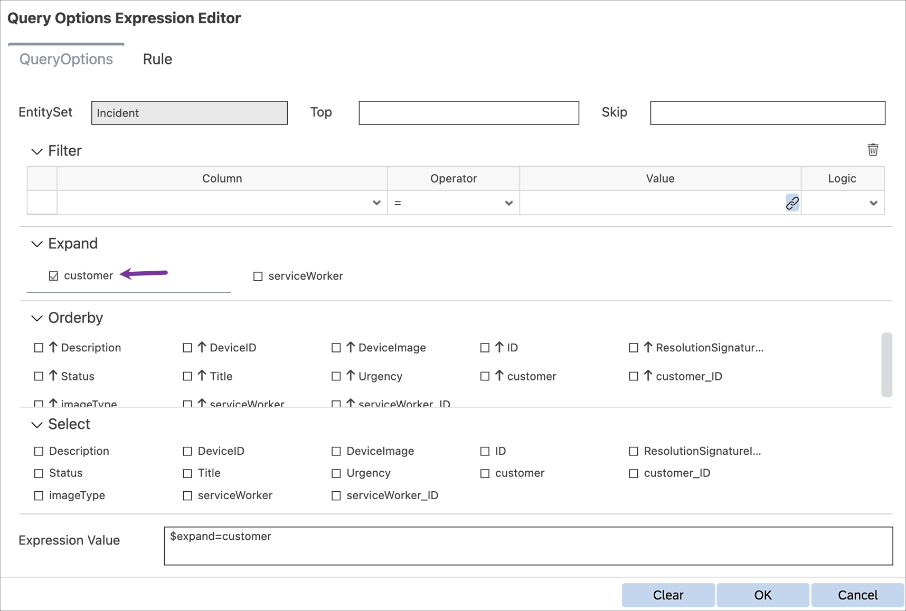 

3. Click on the highlighted area to access the existing Object Header control.

    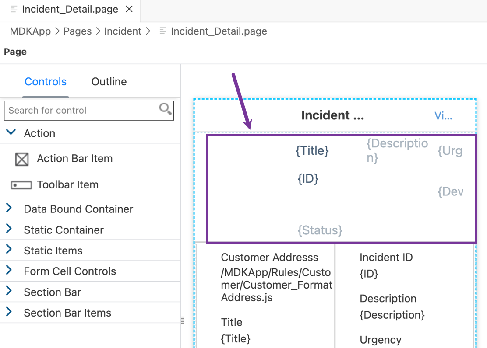 

4. Right-click on the Object Header control and **Delete** it.

    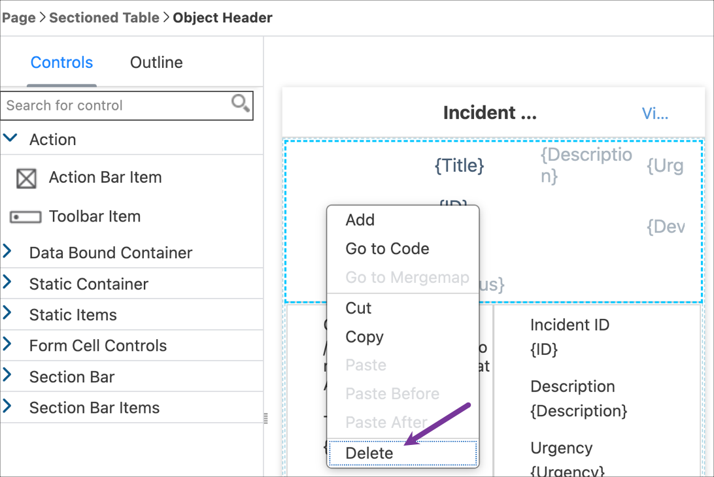 

5. Now, you will add the **Profile Header** control to display information such as name, location and communication methods with a customer.   In the Layout Editor, expand the **Controls** | **Static Container** group, then drag and drop the **Profile Header** control onto the page area.

    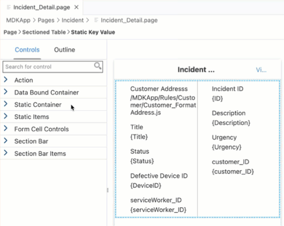 

6. In the **Properties** pane under **Appearance**, clear the default value for the `Description` property. 

7. For the `DetailImage` property, click on the link icon to open the Object Browser, search for the `customer` SAP icon and double click on it. 

    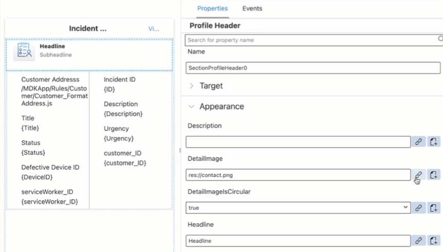 

8. For the `Headline` property, click on the link icon to open the Object Browser and bind to Customer's First and Last names.

    * In the search field, look for `first`, select `FirstName` and **double-click on it**. The binding `{customer/FirstName}` will be generated in the expression box. **Do not close the Object Browser window**.
    * Add a space after the generated value.
    * Look for `last` in the search field, select `LastName` and **click on `Insert`**. You'll notice the binding `{customer/FirstName} {customer/LastName}` generated in the expression box. 
    * Click **OK** to set the value to the control field.

    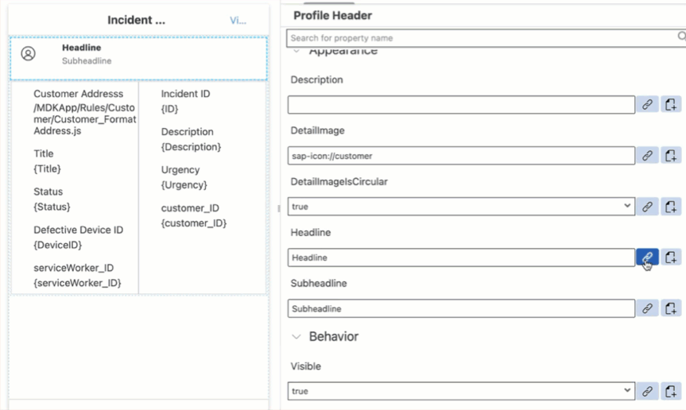 

9. Follow similar instructions for the `Subheadline` property, binding it to the customer's city and country values `{customer/AddressCity} {customer/AddressCountry}`. 

    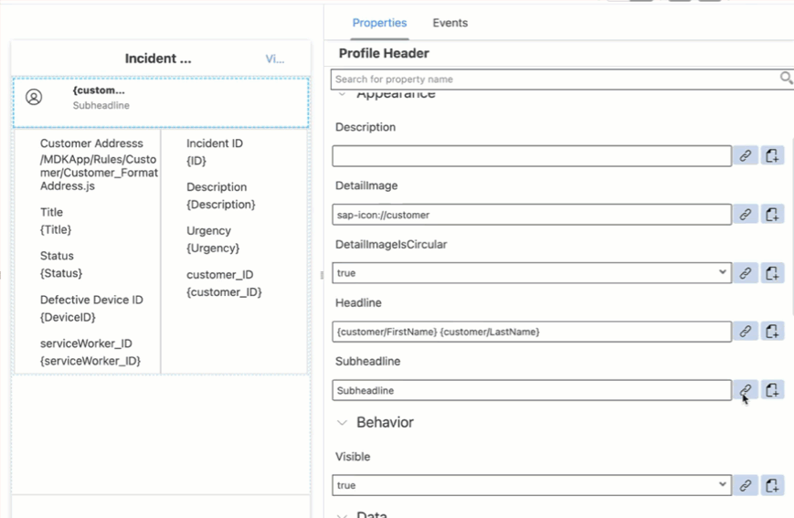  

10. Under the `ActivityItems` section in the Properties pane, click **Add** to create a new activity item.

    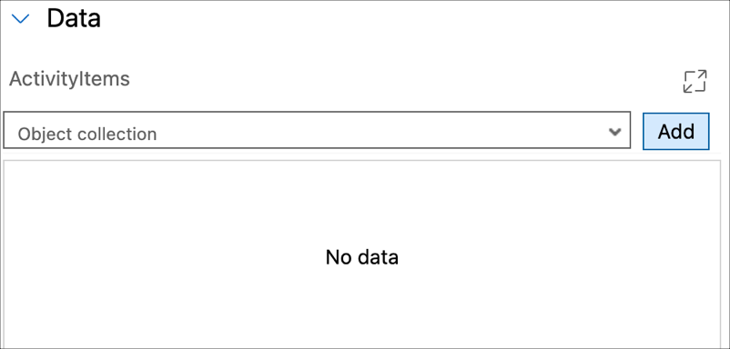 

11. Expand the newly added item, then click the three-dot icon to open the Object Browser. Bind the `ActivityValue` to the `Phone` property of the Customer entity.

    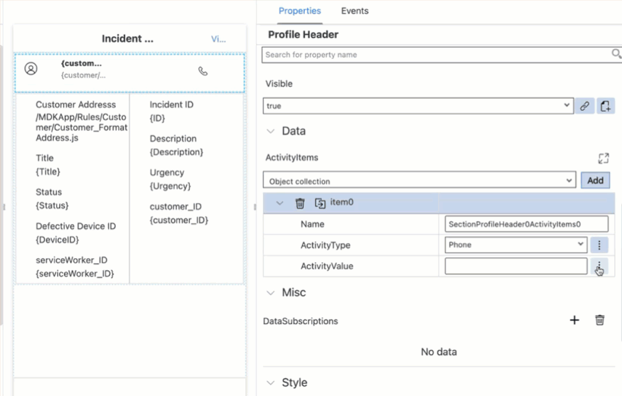 

12. Add two more activity items in a similar manner for Email and Phone, and bind them to the customer's Email and Phone properties.

    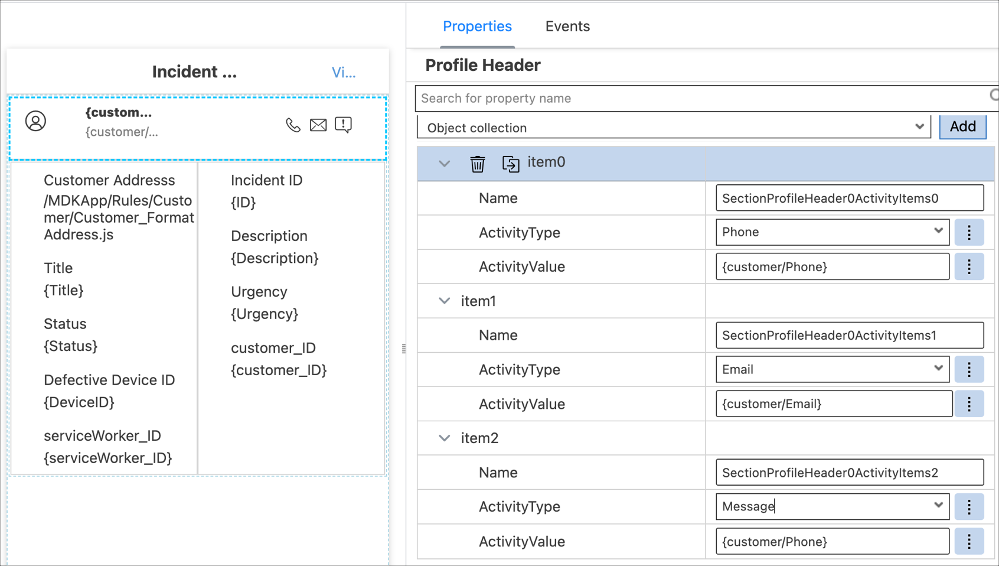 

### Exercise 3.4 - Redeploy the application
1. Right-click the `Application.app` file in the project explorer pane and select `MDK:Deploy`.

    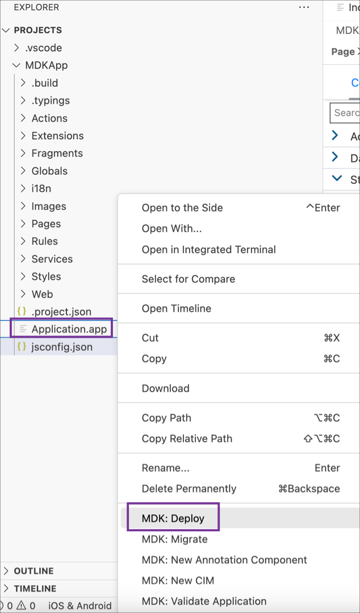

    >If you are prompted to login to Cloud Foundry, please follow the steps outlined [here](../ex1/README.md#exercise-13---display-the-qr-code-for-onboarding-the-mobile-app)

8. Next, select the deploy target as **Mobile Services**.

    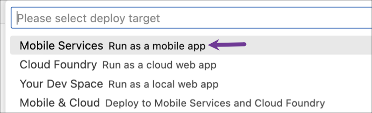

    When the deployment is successful, a success message will appear.

    

    >Version 1 was pre-deployed to your mobile services app.

### Exercise 3.5 - Update the MDK app with new metadata
| Steps      | Android | iOS     |
| :---:        |    :----:   |  :---: |
| 1. Tap the **Check for Updates** option in the `User menu` on the Incident page.      | 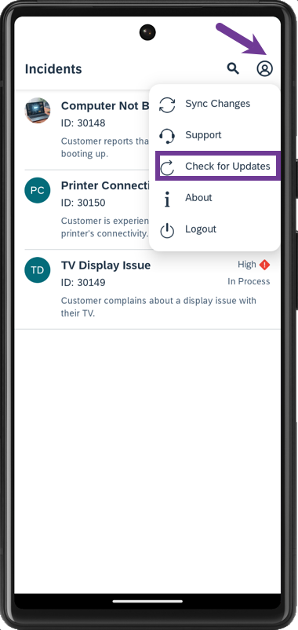       | 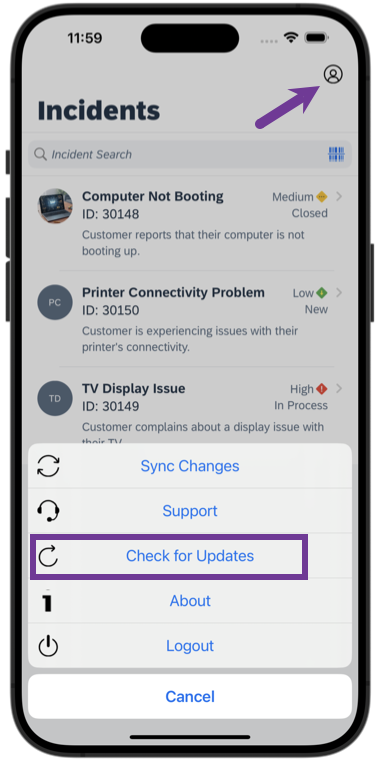   |
| 2. You will see a `New Version Available!` pop-up.  Tap **Now**.     | 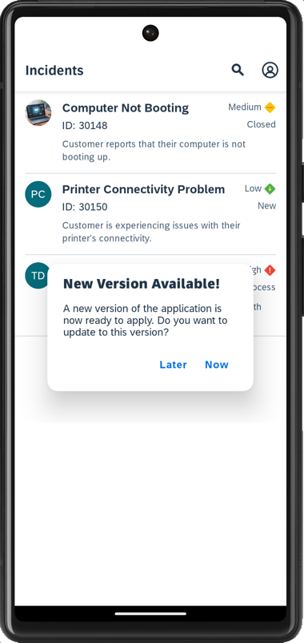       |    |
| 3. On the Incident list page, you now see the customer's name and a filter bar for applying quick filters.   On the Detail page, a profile header will display the customer's details and communication items. This will allow you to email, make a phone call, or send a message to the customer.   | 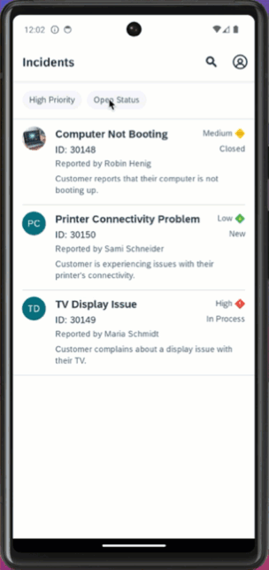       | 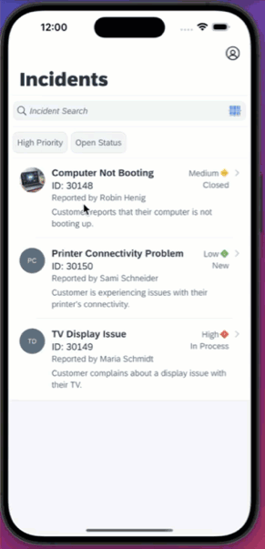   |

## Summary
You've updated the template-generated pages to better suit the technician. They can now easily understand the information and reach out to the customer when needed.

## Navigation
| Previous| Next |
|---|---|
| [Exercise 3](../ex3/README.md) | [Exercise 5](../ex5/README.md) | 

