# Exercise 3 - Modify an Incident Record

## Navigation
| Previous| Next |
|---|---|
| [Exercise 4](../ex4/README.md) | [Conclusion](../Conclusion.md) | 
|  | [Exercise 6](../ex6/README.md) | 

## Objective
Incidents are assigned to a Technician by a call center support representative. At the start of their day, the technician commences work on these incidents while at the customer's location.
- If the status of an incident is `new`, the technician has the ability to update it to `In Process`. They should be able to enter the ID of the defective device, either by manually typing it or scanning the device's barcode.
- The technician is also capable of updating the status from `new` to `Closed` or from `In Process` to `Closed` following the resolution of an issue. Ensuring that they:
    - manually input or update the ID of the defective device or scan the device's barcode,
    - upload a photograph of the working device, and
    - acquire the digital signature of the customer confirming that the issue has been resolved, is crucial.
- If an incident's status is already `Closed`, the technician will not see any option to modify the details. They have the ability to view its details and open the working device's image.

## Estimated time
:clock4: 25 minutes

## Index
| Exercise Number | Exercise Description                                                   |
|-----------------|-----------------------------------------------------------------------|
| 5.1             | [Create a new page for modifying Incident Information](#exercise-51---create-a-new-page-for-modifying-incident-information) |
| 5.2             | [Add a Cancel Button on the Update incident Detail page](#exercise-52---add-a-cancel-button-on-the-update-incident-detail-page) |
| 5.3             | [Store the updated data locally](#exercise-53---store-the-updated-data-locally) |
| 5.4             | [Navigate to the Incident Edit page](#exercise-54---navigate-to-the-incident-edit-page) |
| 5.5             | [Redeploy the application](#exercise-55---redeploy-the-application) |
| 5.6             | [Update the MDK app with new metadata](#exercise-56---update-the-mdk-app-with-new-metadata) |


### Exercise 5.1 - Create a new page for modifying Incident Information
Both online and offline applications can be modified by users. Online application changes are saved to the backend immediately, while offline ones are stored locally until they are synced with an Upload action.<br/> In this step, you'll create a Section page with a Form Cell section for the Form Cell controls. This page will display a subset of items from the Incident Detail page, specifically the fields editable by the technician.

1. Navigate to **Pages** | Right-click the **Incident** folder | **MDK: New Page**.

    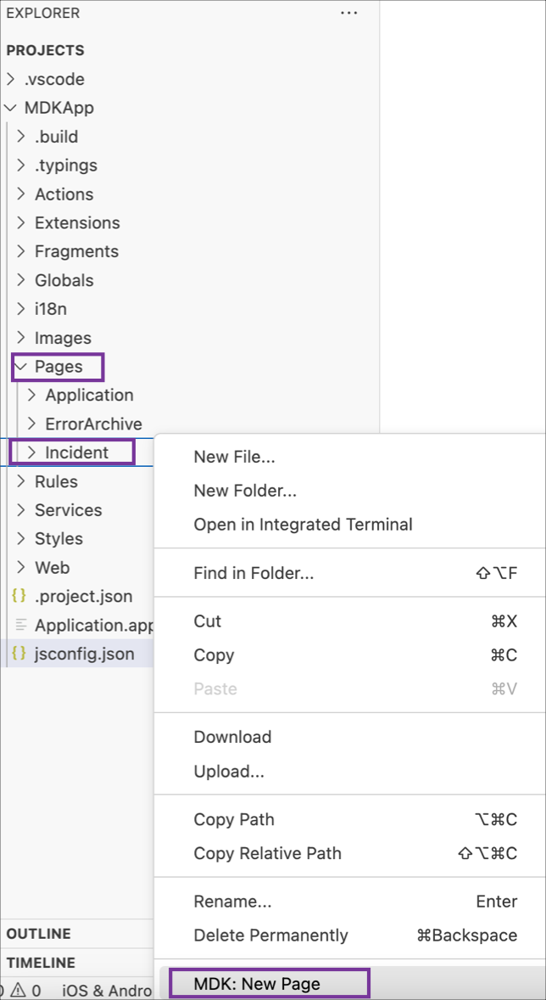

2. Choose **Section** and click **Next**.

    

3. In the **Base Information** step, enter the page **Name** as `Incident_Edit` and click **Finish**.

    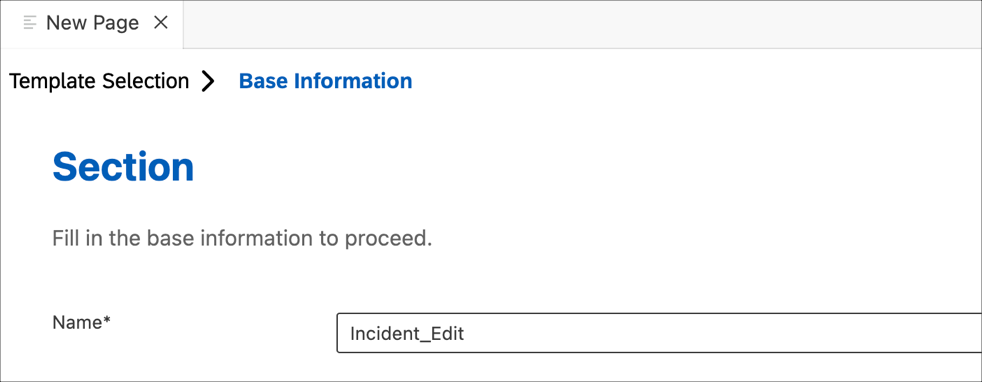

4. In the `DesignTimeTarget` section, provide the below information. This enables validation of the binding context of the current page and access to the Incident and Customer entities at design time.

    | Property | Value |
    |----|----|
    | `Service` | Choose `IncidentManagement.service` from the dropdown |
    | `EntitySet` | Choose `Incident` from the dropdown |    
    | `QueryOptions` | `$expand=customer` |    

    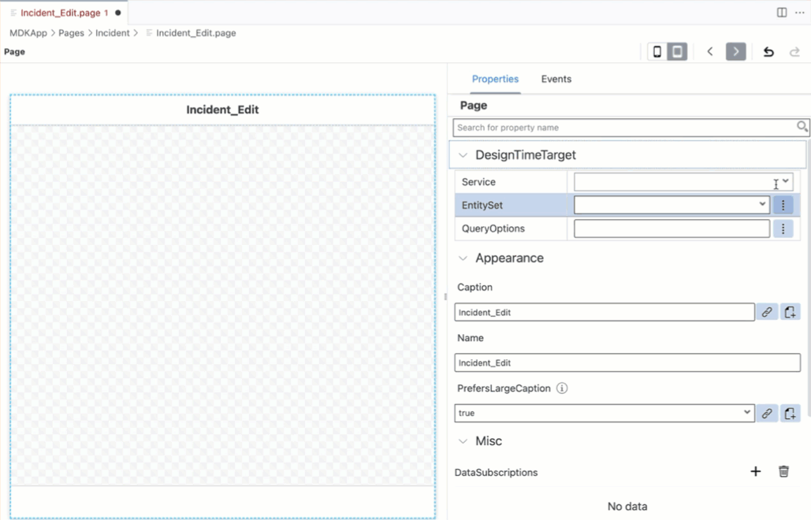

5. In the **Properties** pane, set the **Caption** to **Update Incident Detail**.

    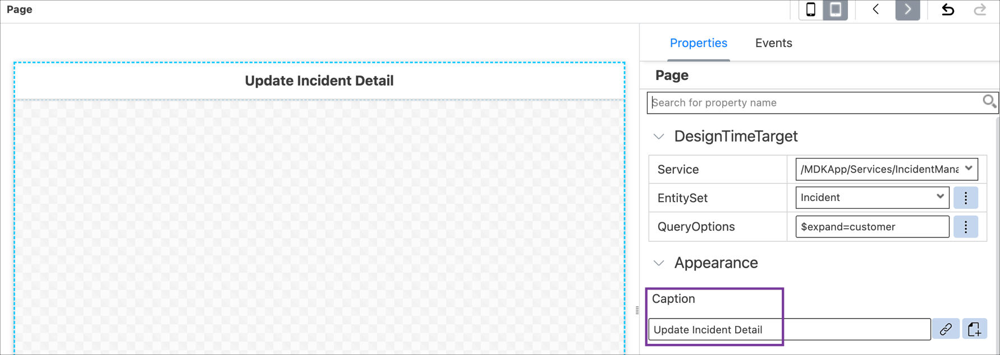

6. Next, you'll add fields editable by a technician, including status, ID of the defective device name, device image, and customer signature. In the Layout Editor, expand the **Static Container** group. Drag and drop **Form Cell** onto the Page area.

    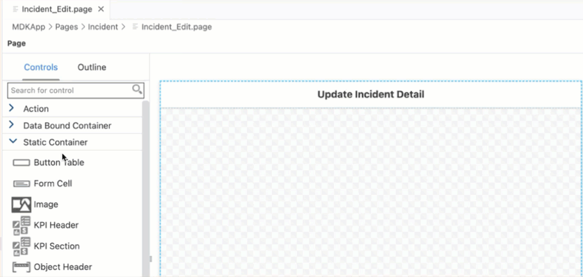

>The Form Cell section is used to contain Form Cell controls on a section page.

7. You will now add Form Cell controls to the Form Cell section. Expand the **Form Cell Controls** group, drag and drop a **List Picker** onto the Page area.

    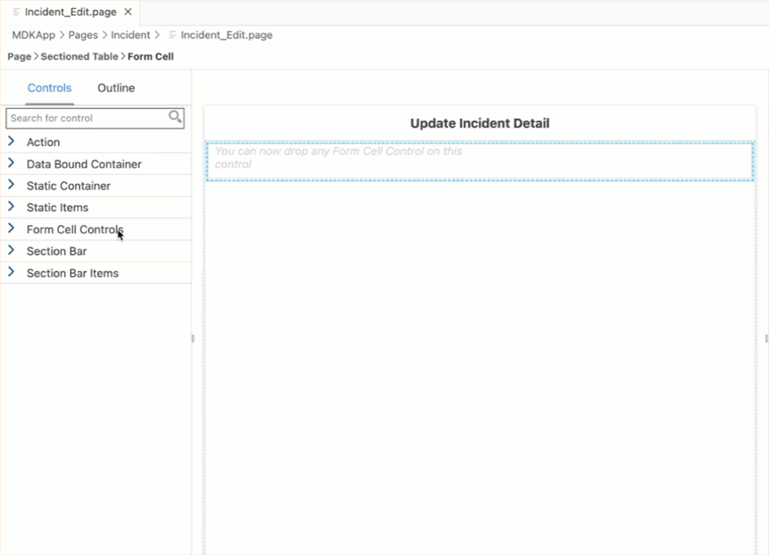

8. Provide the following information:

    | Property | Value |
    |----|----|
    | `Name`| `FCStatus` |
    | `Caption` | `Status` |
    | `AllowEmptySelection` | Choose `false` from the dropdown |
    | `IsPickerDismissedOnSelectionption`  | Choose `true` from the dropdown |
    | `AllowDefaultValueIfOneItem` | Choose `true` from the dropdown |

    

    >`AllowEmptySelection:` This disables or enables the selection of empty value set.
    >`IsPickerDismissedOnSelectionption:` This enables automatic dismissal of the list view after an entry is selected.
    >`AllowDefaultValueIfOneItem:` This enables automatic selection of the default value for the List Picker if only one item is available. It's applicable when a technician updates the status of an incident from `In Process` to `Closed`.

9. When a technician is updating the status of an incident, they should be presented with specific options depending on the current status of the incident.
    - If the current status is `New`, the technician should see the options `In Process` and `Closed`.
    - However, if the current status is `In Process`, the technician should only see the `Closed` option. <br/> This behavior should be built into your application's programming logic. <br/> In **Properties** pane, for the `PickerItems` property, choose **Rule**. Click on the three-dot icons and select **Create a Rule**.

    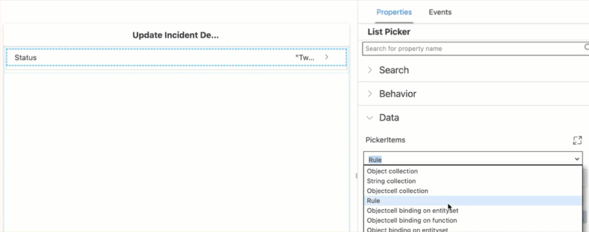

10. Choose `/MDKApp/Rules/Incident` path for  *Folders* and click **OK**. This keeps all related files in a related folder.
    
    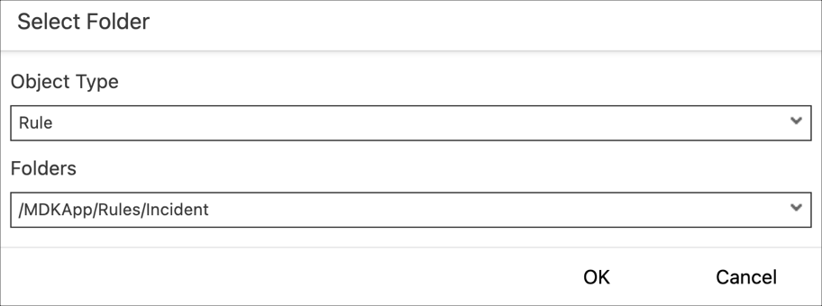

11. In the **Base Information** step, enter the Rule **Name** as `StatusPicker` and then click **Finish**.

    

12. Replace the generated snippet with the following code.

    ```JavaScript
    /**
    * Describe this function...
    * @param {IClientAPI} clientAPI
    */
    export default function StatusPicker(clientAPI) {
        //get the current status of an incident
        let currentStatus = clientAPI.binding.Status;
        if (currentStatus == "New") {
            return [{
                "DisplayValue": "In Process",
                "ReturnValue": "In Process"
            }, {
                "DisplayValue": "Closed",
                "ReturnValue": "Closed"
            }];
        } else {
            return [{
                "DisplayValue": "Closed",
                "ReturnValue": "Closed"
            }];
        }
    }
    ```

13. Remove the default picker item value. 

    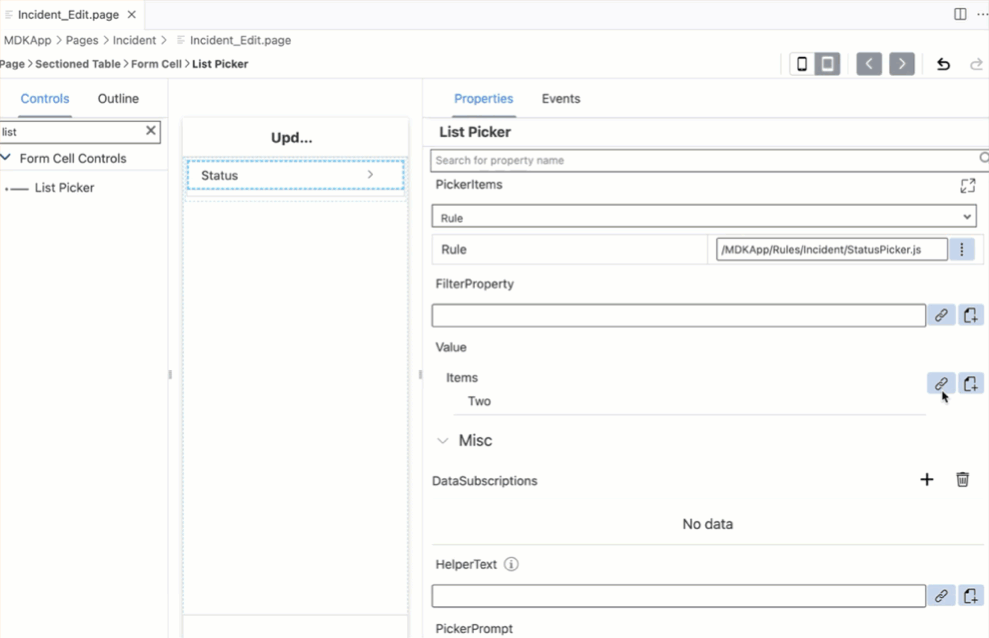

14. Drag and drop a **Simple Property** Form cell control onto the `Ìncident_Edit.page` area. This allows a technician to manually input or scan the ID of the defective device.

    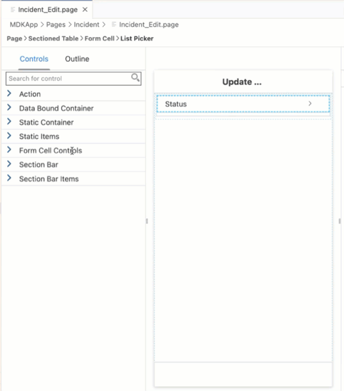

15. Provide the following information:

    | Property | Value |
    |----|----|
    | `Name`| `FCDeviceID` |
    | `Caption` | `Device ID` |
    | `AlternateInput` | Choose `Barcode` from the dropdown |
    | `PlaceHolder`  | `Type in the device's ID or scan its barcode` |

    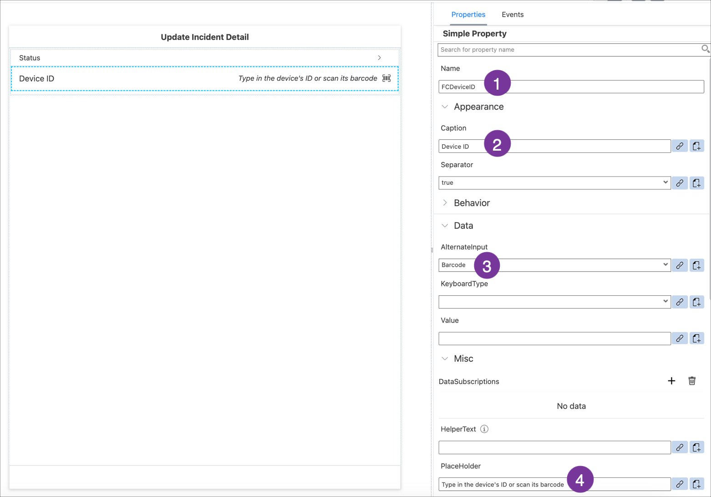

16. Drag and drop an **Attachment** Form Cell control onto the `Ìncident_Edit.page` area. This allows a technician to upload an image of the device they have repaired.  
   
    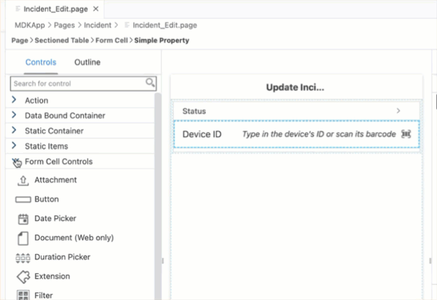

17. Provide the following information:          

    | Property | Value |
    |----|----|
    | `Name` | `FCDeviceImage` |
    | `AttachmentActionType` | Unselect `SelectFile` option |
    | `AttachmentAddTitle` | `Browse` |
    | `AttachmentTitle` | `Device Image` | 

    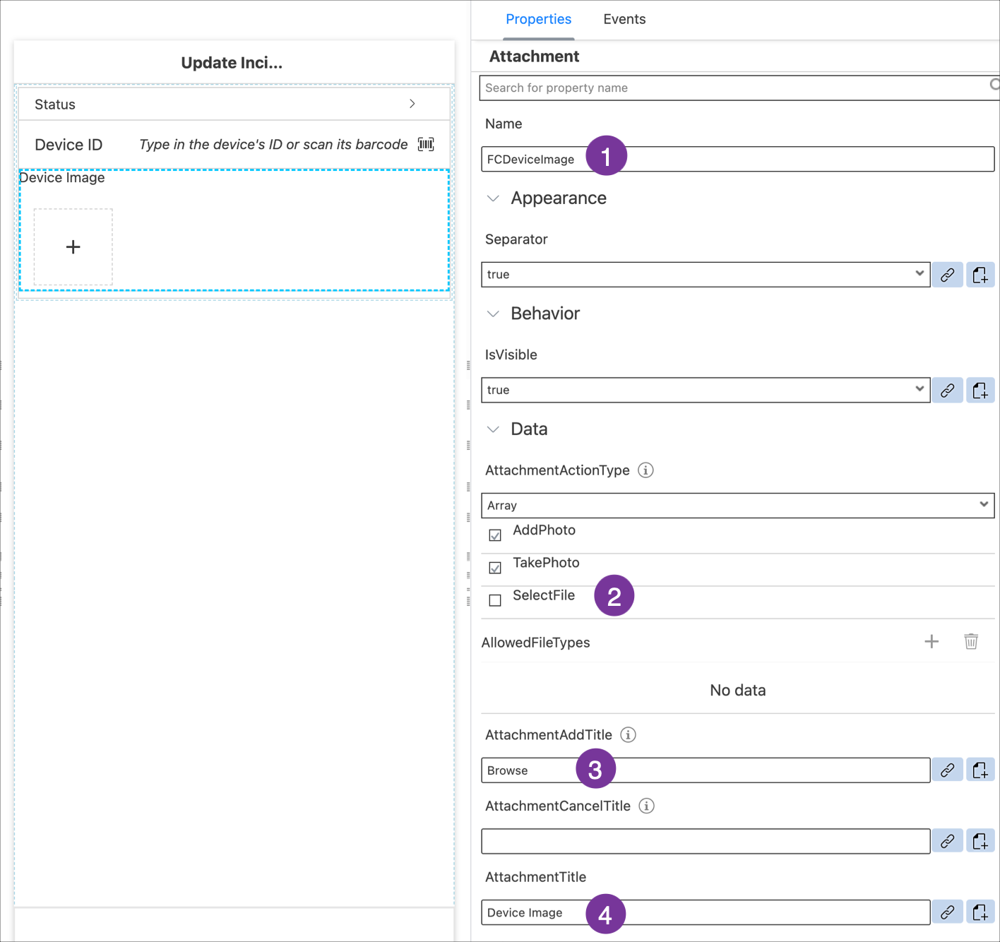

18. Now, drag and drop an **Inline Signature Capture** Form Cell control onto the `Ìncident_Edit.page` area. This enables a technician to collect a digital signature from the customer to confirm that the issue has been resolved.
   
    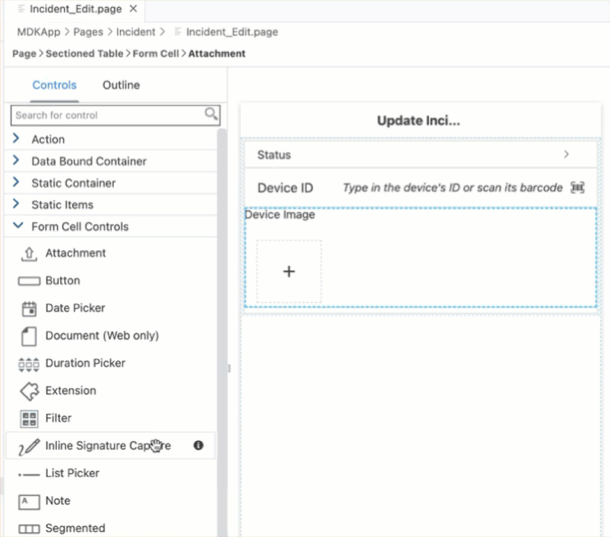

19. Provide the following information:          

    | Property | Value |
    |----|----|
    | `Name` | `FCCustomerSignature` |
    | `Caption` | `Customer Signature` |
    | `ShowTimestampInImage` | Choose `true` option from the dropdown |
    | `TimestampFormatter` | `YYYY-MM-dd 'at' HH:mm:ss` |
    | `WatermarkText` | `Signed by {customer/FirstName} {customer/LastName}` | 

    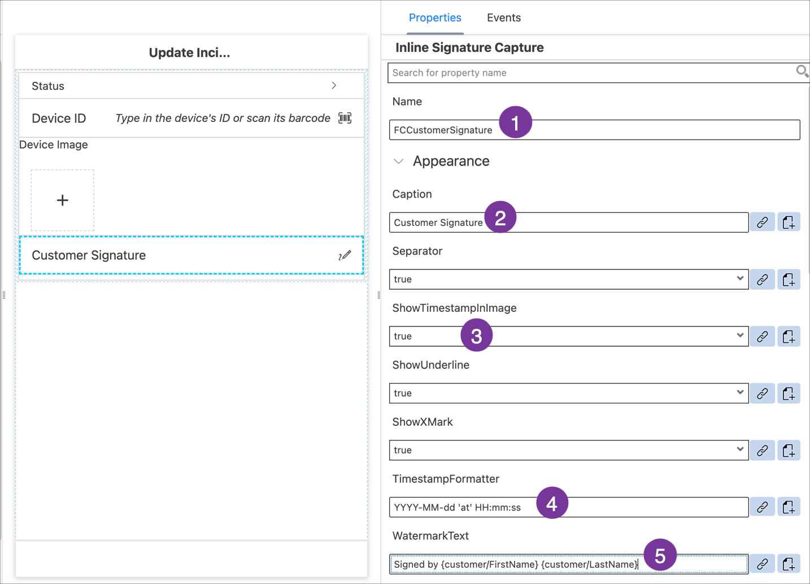

    >`ShowTimestampInImage:` The datetime will be displayed in the captured signature image.
    >`TimestampFormatter:` Set a DateTime format pattern string for the timestamp on the captured signature image.
    >`WatermarkText:` The watermark text will be displayed in the captured signature image.
    >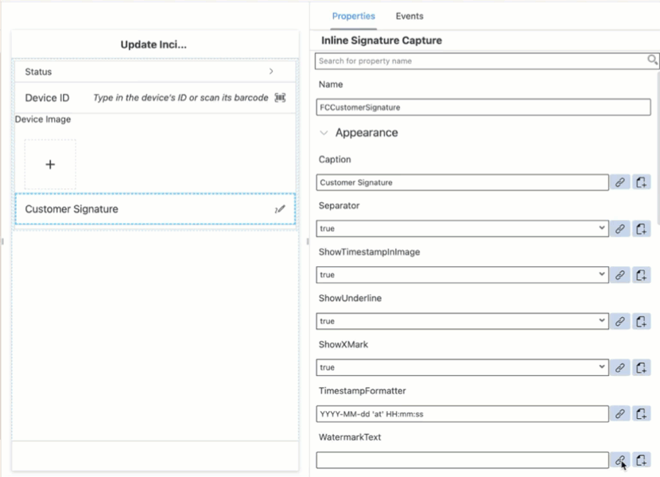

20. If the `In Process` option is chosen from the Status list picker during an Incident modification, the options for uploading a Device Image and capturing customer signature should be hidden. However, if the `Closed` status is selected, the technician should be provided with options to upload an image of the device and collect the customer's signature. This logic needs to be programmatically handled within the application.

    Select `Status` List picker control, navigate to the **Event** tab, Click on **Create a rule/action** for `OnValueChange` event.

    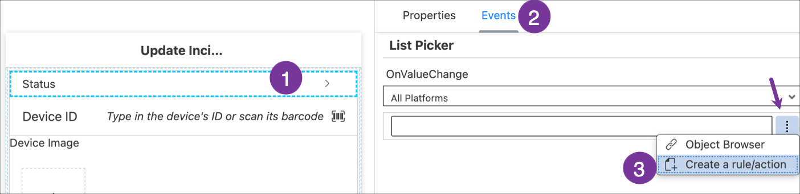

21. Next, select **Object Type** as **Rule** and **Folders** as `/MDKApp/Rules/Incident`. Click **OK**.  

    

22. Provide the name `StatusChangeProtocol` to your rule, Click **Finish**.

    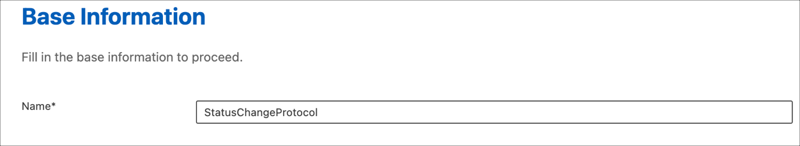

23. Replace the generated snippet with the following code.

    ```JavaScript
    /**
    * Describe this function...
    * @param {IClientAPI} clientAPI
    */
    export default function StatusChangeProtocol(clientAPI) {
        //Get the control based on the name
        const sectionedTable = clientAPI.getPageProxy().getControl('SectionedTable0');
        //Get the section based on the name
        const fcsection = sectionedTable.getSection('SectionFormCell0');
        const fcAttachment = fcsection.getControl('FCDeviceImage');
        const fcSignatureCapture = fcsection.getControl('FCCustomerSignature');
        const selectedValue = fcsection.getControl('FCStatus').getValue()[0].ReturnValue;
        if (selectedValue == "In Process") {
            fcAttachment.setVisible(false);
            fcSignatureCapture.setVisible(false);
        } else if (selectedValue == "Closed") {
            fcAttachment.setVisible(true);
            fcSignatureCapture.setVisible(true);
        }
    }
    ```

### Exercise 5.2 - Add a Cancel Button on the Update incident Detail page
While updating the incident details, you may want to close the current page and cancel or interrupts any ongoing process.

1. In the`Incident_Edit.page.page`, drag and drop an **Action Bar Item** control to the upper left corner of the action bar.

    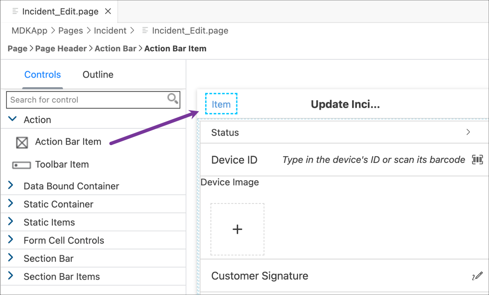

>Action Bar Item is a button that users can use to trigger actions when pressed. You can add an Action Bar Item only to the Action Bar at the top of the page.

2. In the Properties pane, click the **link icon** to open the object browser for the **System Item** property. Double-click the **Cancel** type and click **OK**.

    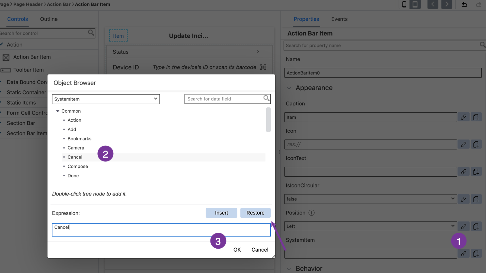

>System Item are predefined system-supplied icon or text and can overwrite `Caption` and `Icon` properties if specified.

3. Navigate to the **Events** tab. Click the three-dot icon, then click the **Object Browser** and bind it to `CloseModalPage_Cancel.action`. This enables you to close pages with the option to either terminate ongoing events or wait until they are complete.

    

### Exercise 5.3 - Store the updated data locally
While a Technician is updating incident information, such as Status, Device ID, Device Image, and Customer Signature, these details will be communicated to the backend through relevant OData calls based on entity type and their respective OData property types.

    You can find details of the service definition in your MDK metadata project `/Services/.IncidentManagement.xml`.
    
    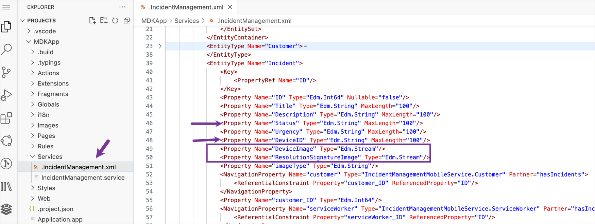

    To update the `Status` and `DeviceID` properties of Incident entity, the OData Update Entity action is used. <br/> However, when dealing with the `DeviceImage` and `ResolutionSignatureImage` properties of the Incident entity, which are of type Edm.Stream, the OData UploadStream action is used. These properties likely store binary data, such as images or files. 

    - You will now add an Action Bar item on the `Incident_Edit.page`. This item will trigger an OData Update Entity action to save the Status and Device ID.
    - Upon successful completion of the OData Update Entity action, an OData Upload Stream action should be initiated to save the Device Image and Customer Signature.
    - Consider closing the page once the update action is executed successfully.
    - A failure message should be displayed if either action fails to store the changes.

1. In the `Incident_Edit.page`, **drag and drop** an **Action Bar Item** to the upper right corner of the action bar.

    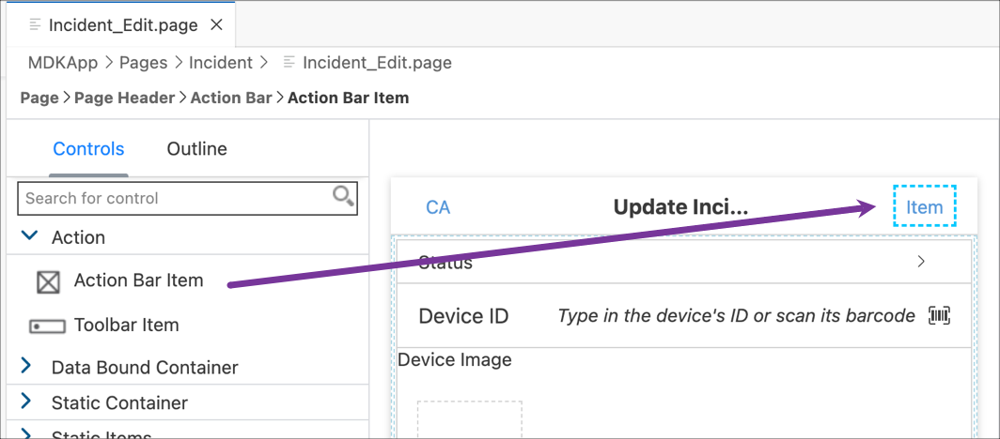

2. In the Properties pane, click the **link icon** to open the object browser for the **System Item** property. Double-click the **Save** type and click **OK**.

    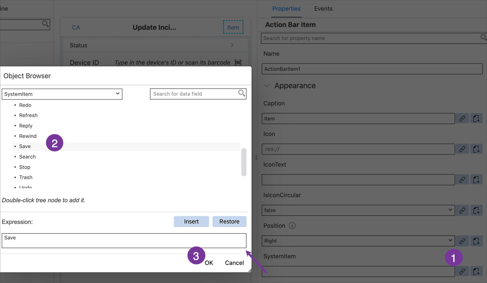

3. Navigate to the **Events** tab. Click the three-dot icon for the `OnPress` property and select the `Create a rule/action`.

    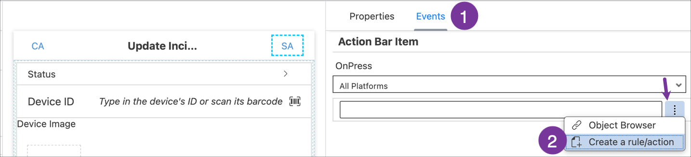

4. Set the selection for the `Object Type` as **Action** and `Folders` path as `/MDKApp/Actions/Incident`.

    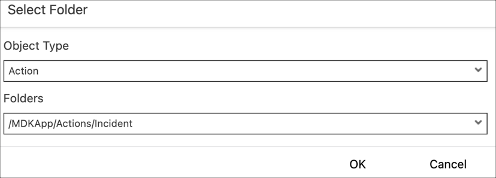   

5. Choose **Data** in **Category** | click **OData** | **Next**.

    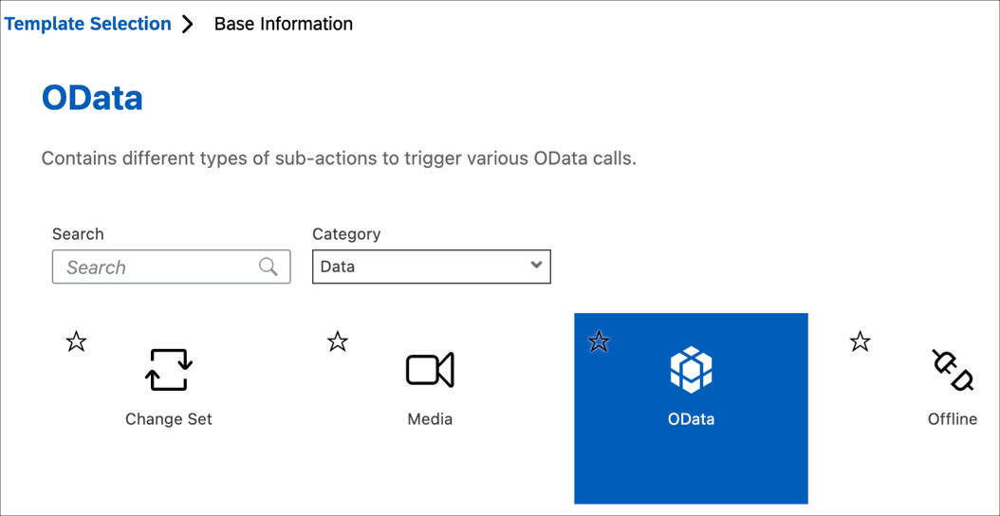   

6. In the **Base Information** step, provide the following information:

    | Property | Value |
    |----|----|
    | `Name`| `Incident_UpdateEntity` |
    | `Type` | Select `UpdateEntity` from the dropdown |
    | `Service`| Select `IncidentManagement.service` from the dropdown |
    | `EntitySet`| Select `Incident` from the dropdown |
    | `ReadLink`| click link icon and double-click `readLink` |

    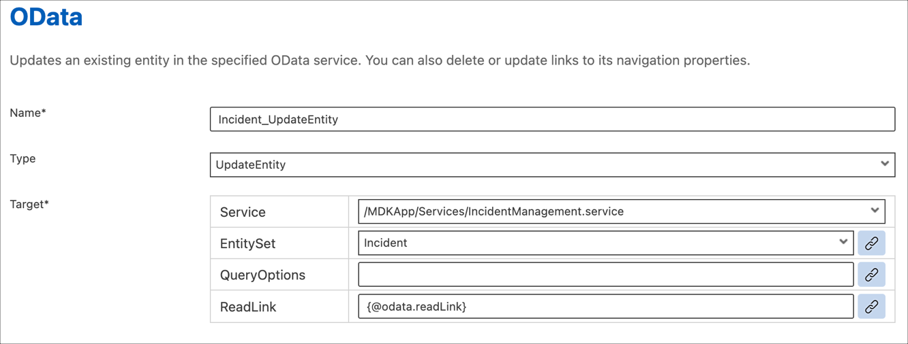  

    >The `readLink` is a direct reference to an individual entity set entry.

7. Click **Next**.

8.  In **Property and Update Links** step, uncheck **ID**.

9.  You will bind `Status` and `DeviceID` OData properties to respective UI Controls. 
    - Select the `Status` property and click the **link icon** to open the object browser. 
    - n the object browser, change the dropdown  to `Controls & ClientData`, and select the  **Current Page** radio button.
    - In the search box, start typing `status`. The list will filter to display the matching values. Double-click the **SelectedValue (Value)** entry under the `FCStatus` field and click **OK** to set binding.

    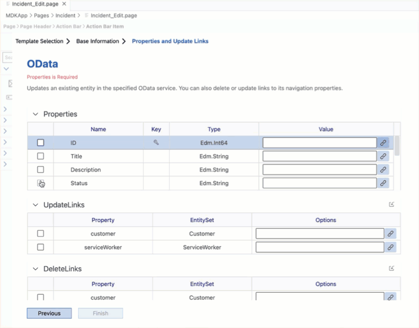  

    >`SelectedValue` provides the return value of List Picker selection.

10. Repeat the above step for DeviceID.
    - Select the `DeviceID` property and click the **link icon** to open the object browser. 
    - Change the drop-down in the object browser to `Controls & ClientData`, click the **Current Page** radio button.
    - In the search box, start typing `device`. The list will filter down to show the matching values. Double-click the **Value (Value)** entry under the `FCDeviceID` field and click **OK** to set binding.

    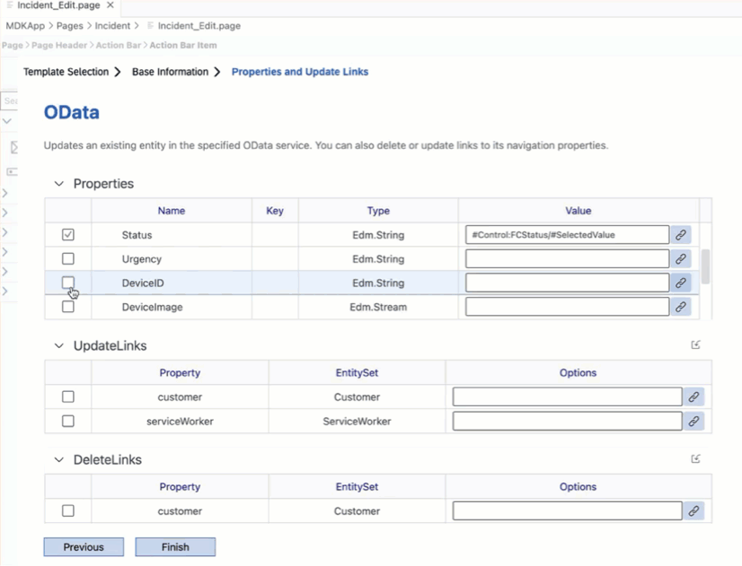 

11. Click Finish. The action editor will open with the `Incident_UpdateEntity.action` loaded.

12. When this `Incident_UpdateEntity.action` fails due to some reason, you may want to display an error. In the `Incident_UpdateEntity.action`, scroll down and expand the **Common Action Properties** section. Click on the link icon for `Failure Action` property to open the object browser and bind to an existing message action `GenericMessageBox.action`.

     

13. Let's override this action's properties and define some specific information about `Incident_UpdateEntity.action`. Click on the override icon to open the override action properties wizard. 

    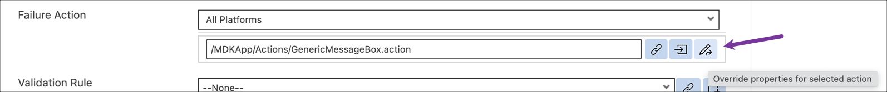 

14. Provide the following information and then click **OK**.

    | Property | Value |
    |----|----|
    | `Message` | `Update entity failure - {#ActionResults:Incident_UpdateEntity/error}` |
    | `Title` | `Update Incident` |
    | `OKCaption` | `OK` |

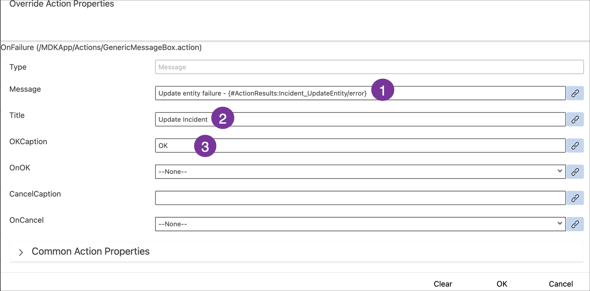 

    >`Incident_UpdateEntity` is the Action Result value of the Incident_UpdateEntity.action. This reference is used to pass the results to subsequent actions in the chain. These actions can reference the action result as needed. In this case if there is a failure, you access the error property of the action result to display the OData failure message. <br/> This is the standard Binding Target Path (also called Dynamic Target Path) syntax used when you need to include a binding with other bindings or within a string as used in the message here.<br/> You could exclude above expression and can just display a generic message.

15. Upon successful completion of the `Incident_UpdateEntity.action`, an OData Upload Stream action should be initiated to save the Device Image and Customer Signature. <br/> Click the `Create a rule/action` icon for the **Success Action**. 

    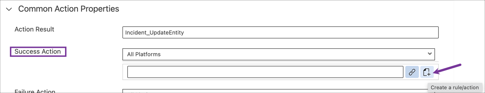 

16. Select **Object Type** as **Action** and `Folders` as `/MDKApp/Actions/Incident`. Click **OK**.

       

17. Choose **Data** in **Category** | click **Media** | **Next**.

    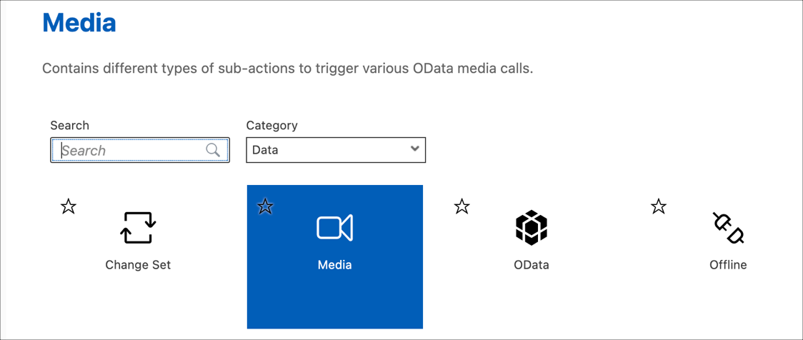   

18. In the **Base Information** step, provide the following information:

    | Property | Value |
    |----|----|
    | `Name`| `Incident_UploadStream` |
    | `Type` | Select `UploadStream` from the dropdown |
    | `Service`| Select `IncidentManagement.service` from the dropdown |
    | `EntitySet`| Select `Incident` from the dropdown |
    | `ReadLink`| click link icon and double-click `readLink` |

    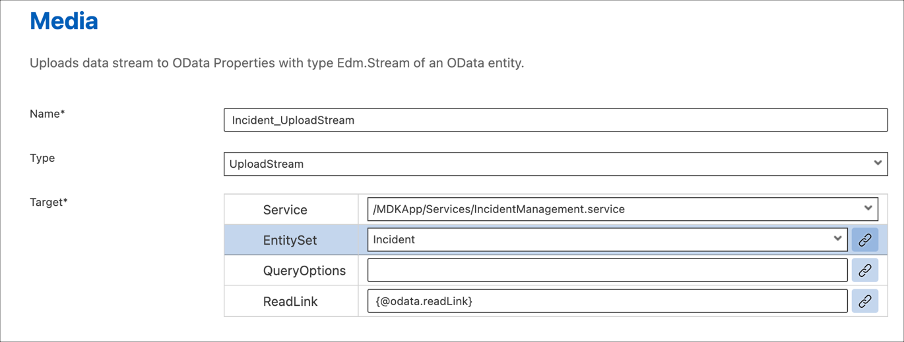 

19. Click **Next**.

20.  In **Property and Update Links** step, select **DeviceImage** if not selected before.

21. Select the `DeviceImage` property and click the **link icon** to open the object browser. 

    -  Change the drop-down in the object browser to `Controls & ClientData`, select the **Current Page** radio button.
    - In the search box, start typing `status`. The list will filter to display the matching values. Double-click the **SelectedValue (Value)** entry under the `FCStatus` field and click **OK** to set binding.

    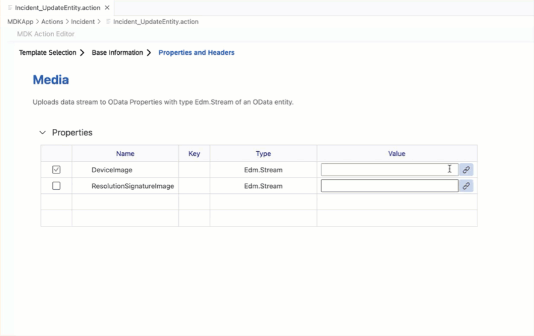 

22. Repeat the above step for the `ResolutionSignatureImage` property.

    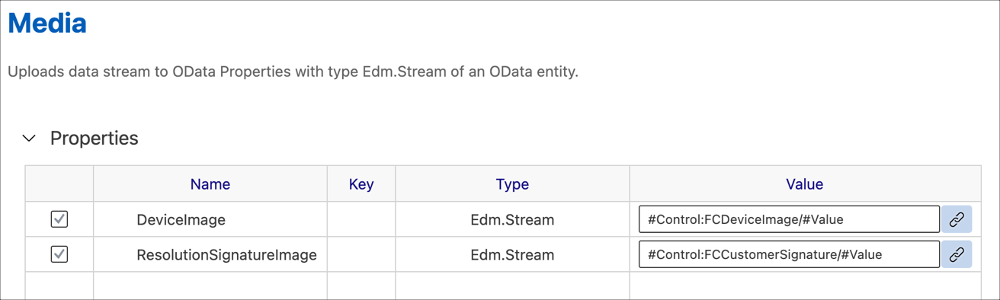 

23. Click Finish. The action editor will open with the `Incident_UploadStream.action` loaded.

24. When the `Incident_UploadStream.action` is executed, you may want to display sucess message and may want to close the page. When it fails due to some reason, you may want to display an error. <br/> In the `Incident_UploadStream.action`, scroll down and expand the **Common Action Properties** section. Click on the link icon for `Success Action` property to open the object browser and bind to an existing message action `GenericToastMessage.action`.

    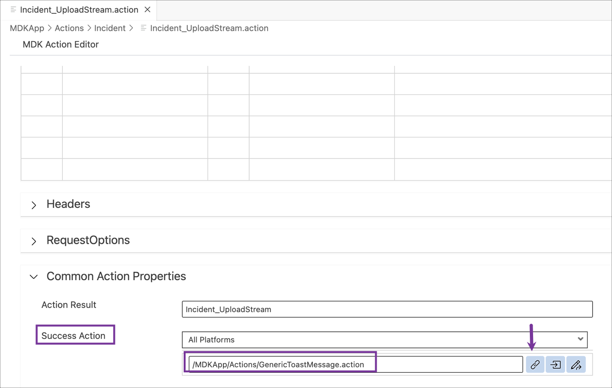 

25. Let's override this action's properties and define some specific information about handling `Incident_UploadStream.action`. Click on the override icon to open the override action properties wizard. 

    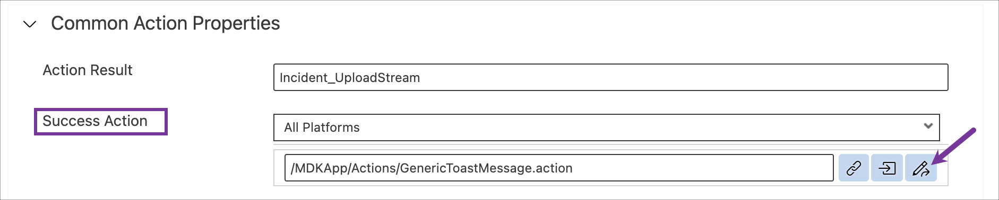 

26. Provide the following information and then click **OK**.

    | Property | Value |
    |----|----|
    | `Message` | `Entity updated` |
    | `Duration` | `2` |
    | `Animated` | Select `true` from the dropdown option |
    | `Succes Action` | Click on the link icon and bind it to `CloseModalPage_Complete.action` |

    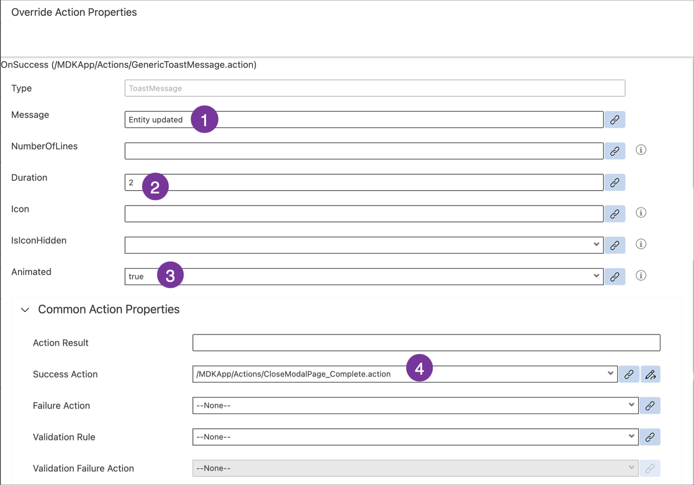 

27. When this `Incident_UploadStream.action` fails due to some reason, you may want to display an error. Click on the link icon for `Failure Action` property to open the object browser and bind to an existing message action `GenericMessageBox.action`.

    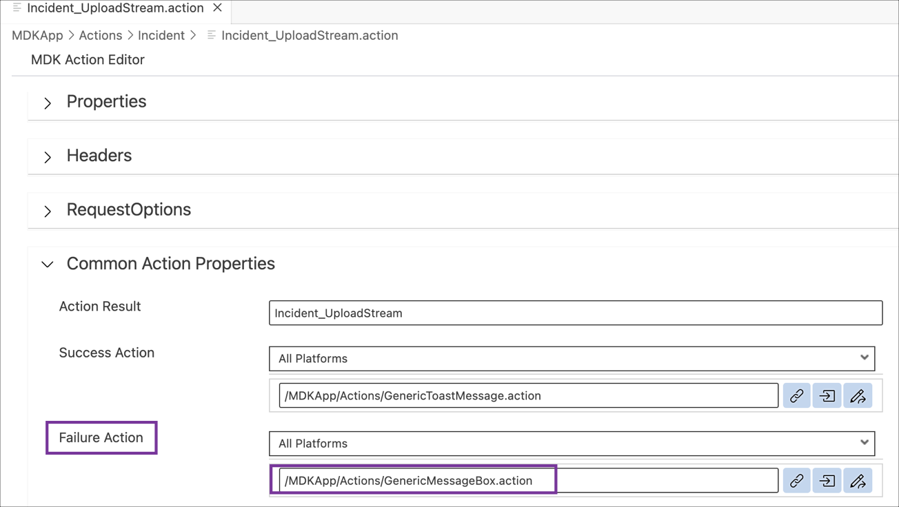 

28. Let's override this action's properties and define some specific information when `Incident_UploadStream.action` fails. Click on the override icon to open the override action properties wizard. 

    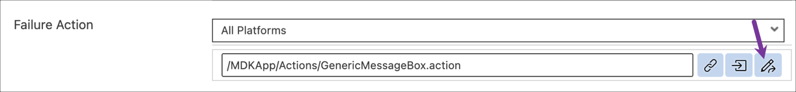 

29. Provide the following information and then click **OK**.

    | Property | Value |
    |----|----|
    | `Message` | `Upload Stream failure - {#ActionResults:Incident_UploadStream/error}` |
    | `Title` | `Upload Stream` |
    | `OKCaption` | `OK` |

    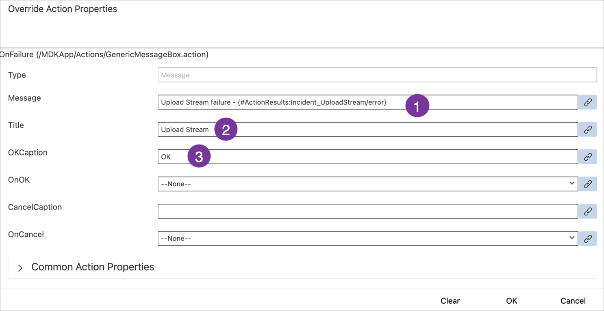 

### Exercise 5.4 - Navigate to the Incident Edit page
To navigate from the Incident Detail page to a new page for modifying incident information, you'll add an action bar item on the Incident Details page and link it to a navigation action. When the action bar item is pressed by a technician, it will open the `Incident_Edit.page`.

1. In `Incident_Detail.page`, drag and drop an **Action Bar Item** to the upper right of the action bar, placing it before the existing `View Image` item.

    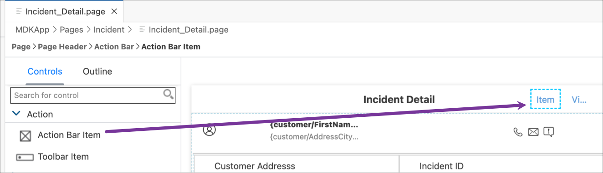    

2. Click the **link icon** to open the object browser for the **System Item** property.<br/> Double-click the **Edit** type and click **OK**.

        

3. The Edit button should only be visible for incidents that are in the `New` or `In Process` state. If an incident's status is `Closed`, the technician should not have any options to change the details. This behavior should be integrated into your application's programming logic. <br/>  Click on `Create a rule` icon for the **Visible** property of Edit action bar item.

    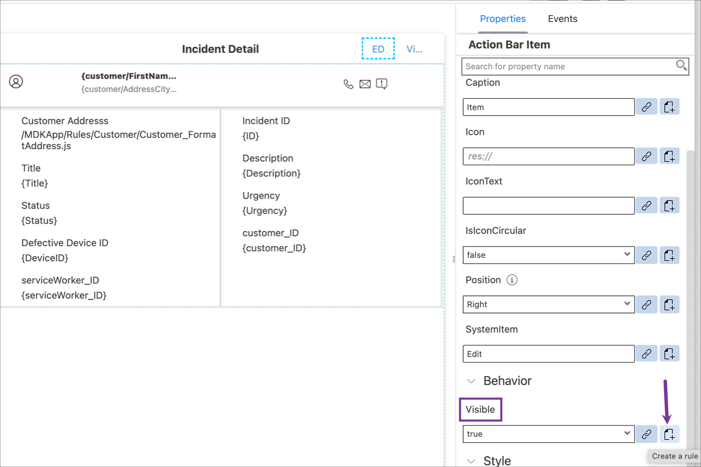   

4. Select **Object Type** as **Rule** and **Folders** as `/MDKApp/Rules/Incident`. Click **OK**.  

    

5. Provide the name `EditOptionVisibility` to your rule, and then click **Finish**.

    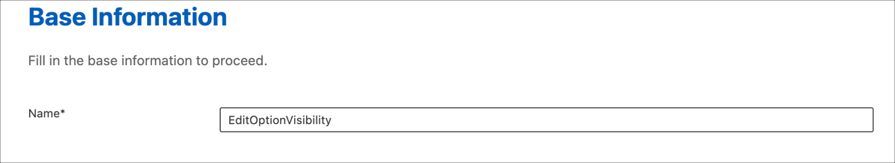  

6. Replace the generated snippet with the following code.

    ```JavaScript
    /**
    * Describe this function...
    * @param {IClientAPI} clientAPI
    */
    export default function EditOptionVisibility(clientAPI) {
        let currentStatus = clientAPI.binding.Status;
        if (currentStatus == "Closed") {
            return false;
        }
        else {
            return true;
        }
    }
    ```

7. Swich back to the `Incident_Detail.page`.

8. Navigate to the **Events** tab. Click the three-dot icon for the `OnPress` property, and select `Create a rule/action`.

    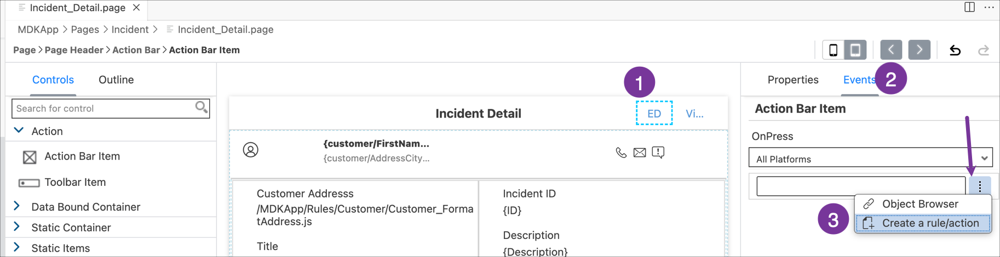     

9. Set the selection for the `Object Type` as **Action** and choose the `Folders` path as `/MDKApp/Actions/Incident`.

       

10. Choose **UI** in **Category** | click **Navigation** | **Next**.

    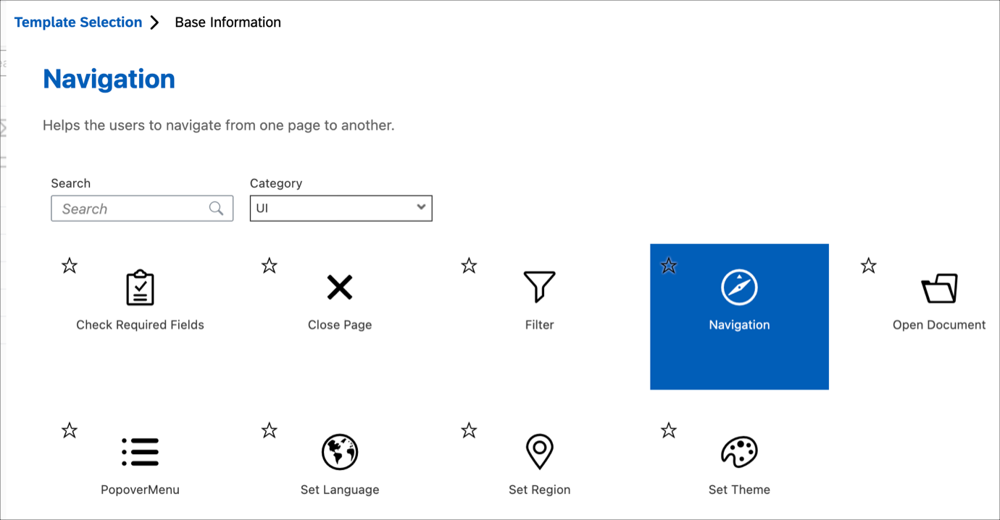  

11. Provide the following information:

    | Property | Value |
    |----|----|
    | `Action Name`| `NavToIncident_Edit` |
    | `PageToOpen` | Select `Incident_Edit.page` from the dropdown |
    | `ModalPage`| Select `true` from the dropdown |

    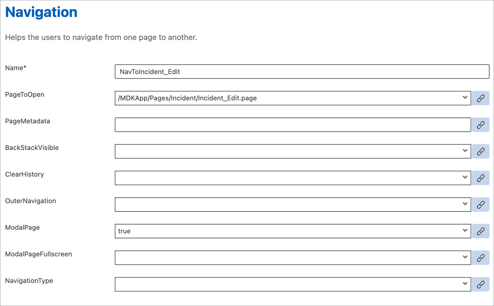  

12. Click **Finish** to complete the action creation process. 

### Exercise 5.5 - Redeploy the application
1. Right-click the `Application.app` file in the project explorer pane, choose `MDK:Deploy` and then select deploy target as **Mobile Services**.

    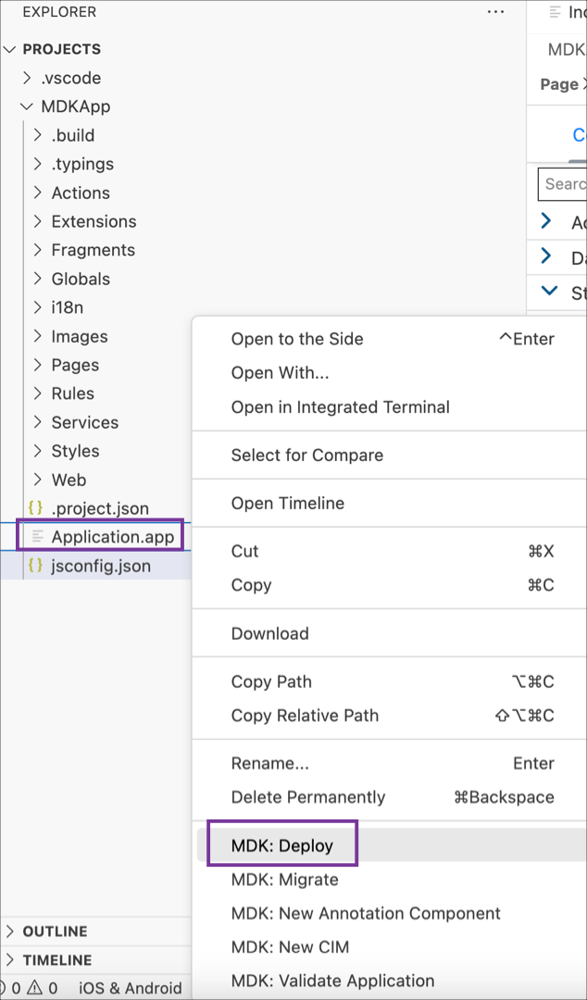
    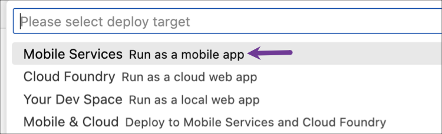

    >Alternatively, you can select `MDK: Redeploy` from the command palette. To access the command palette, go to the View menu and choose Command Palette, or press Command+Shift+P on a Mac or Ctrl+Shift+P on a Windows machine. This command will perform the last deployment.
    >

### Exercise 5.6 - Update the MDK app with new metadata
| Steps      | Android | iOS     |
| :---        |    :----:   |          ---: |
| 1. Tap the **Check for Updates** option in the `User menu` on the Incident page.      | 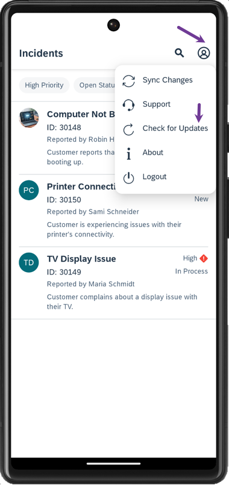       | 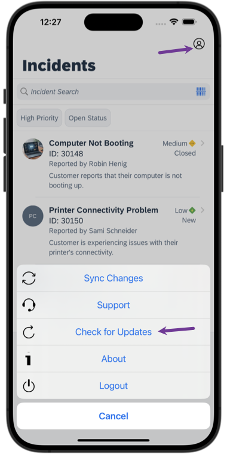   |
| 2. You will see a `New Version Available!` pop-up. Tap **Now**.     | 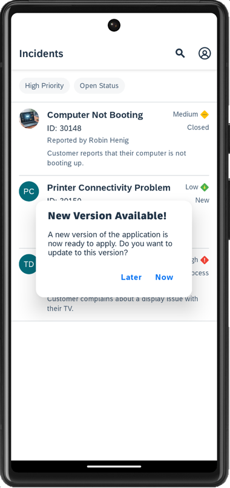       | 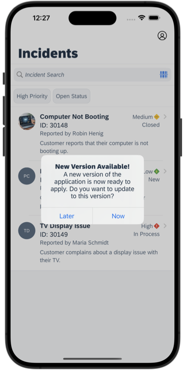   |
| 3. Navigate to an Incident detail page. <br/> If an incident's status is already `Closed`, you will not see the Edit option on its details. n. Instead, you will have the ability to open the working device's image. <br/>  If an incident's status is `New` or `In Process`, you will the Edit option. | 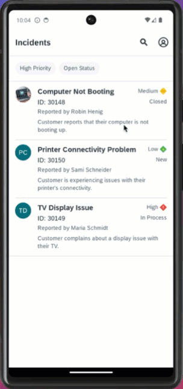       | 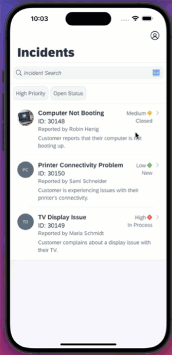   |
| 4. Update an Incident. <br/> you can update the status from `new` to `In Process` or `Closed` or from `In Process` to `Closed`. <br/> When updating it to `In Process`, you should be able to enter the ID of the defective device, either by manually typing it or scanning the device's barcode, but you won't have options for uploading a device image or capturing the customer's signature. <br/> When updating it to `Closed`, you should be able to enter the ID of the defective device, either by manually typing it or scanning the device's barcode, and you should also see the options for uploading a device image and capturing customer's signature. <br/> To scan the device's barcode, you can use the below image.  | 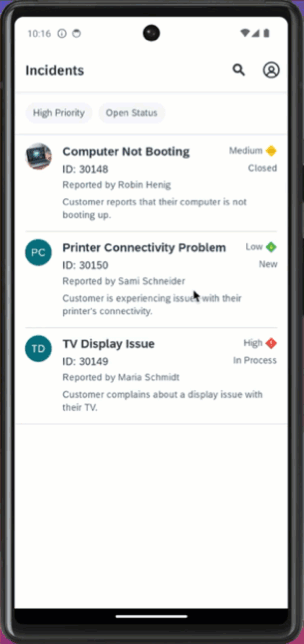       |    |
| 5. Since this is an Offline application, the changes are saved to the local store, which needs to be sent or uploaded to the backend explicitly. <br/> Navigate to the Incident list page, pull down on the incident list to upload changes to the backend, OR click on the user menu icon and select **Sync Changes**. You will see a successful message.    |        | 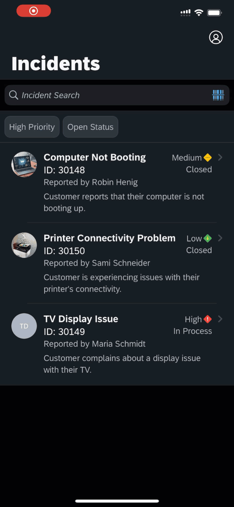   |

>Optionally, you can inform the technician about the maximum allowed number of images for the device. It's worth noting that more than one image can be added in the attachment control. However, in the case where more than one image is attached, the technician shouldn't be able to save the record. The technician should only be able to save the record when there is exactly one device image attached to an Incident entity. To achieve this, you'll need to implement programmatic logic that validates the attachment and binds it to the Save ActionBar item on the Incident edit page.<br/>
>
```JavaScript
/**
 * Describe this function...
 * @param {IClientAPI} clientAPI
 */
export default function Incident_ValidateDeviceImageAttachment(clientAPI) {
    var attachments = clientAPI.getPageProxy().getControl('SectionedTable0').getSection('SectionFormCell0').getControl('FCDeviceImage').getValue();
    if (attachments.length !== 1) {
        return clientAPI.executeAction({
            "Name": '/MDKApp/Actions/GenericMessageBox.action',
            "Properties": {
                "Message": attachments.length < 1 ? "Please add 1 device image" : "Max. 1 image allowed for the device",
                "Title": "Alert",
                "OKCaption": "OK"
            }
        })
    } else {
        return clientAPI.executeAction('/MDKApp/Actions/Incident/Incident_UpdateEntity.action');
    }
}
```

## Summary

You've now successfully modified an incident entity. 

## Navigation
| Previous| Next |
|---|---|
| [Exercise 4](../ex4/README.md) | [Conclusion](../Conclusion.md) | 
|  | [Exercise 6](../ex6/README.md) | 