# Exercise 4 - Integrate with SAP Mobile Start

## Navigation
| Previous| Next |
|---|---|
| [Exercise 5](../ex4/README.md) | [Conclusion](../Conclusion.md) | 

## Objective
The SAP Mobile Start app is your native entry point to SAP’s mobile universe. Discover how custom apps appear in SAP Mobile Start and can be launched. Experience SAP Mobile Start on your own mobile device.

## Estimated time
:clock4: 25 minutes

### Exercise 6.1 - Set Up SAP Build Work Zone, standard edition Using a Trial Account

1. Follow the [**Set Up SAP Build Work Zone, standard edition Using a Trial Account tutorial**](https://developers.sap.com/tutorials/cp-portal-cloud-foundry-getting-started.html) on developers.sap.com. 

### Exercise 6.2 - Create a Site Using SAP Build Work Zone, standard edition

1. Follow the [**Create a Site Using SAP Build Work Zone, standard edition tutorial**](https://developers.sap.com/tutorials/cp-portal-cloud-foundry-create-sitelaunchpad.html) on developers.sap.com. 

### Exercise 6.3 - Add a URL App to Your Site

1. Click the Content Manager icon in the side panel to open the Content Manager.

      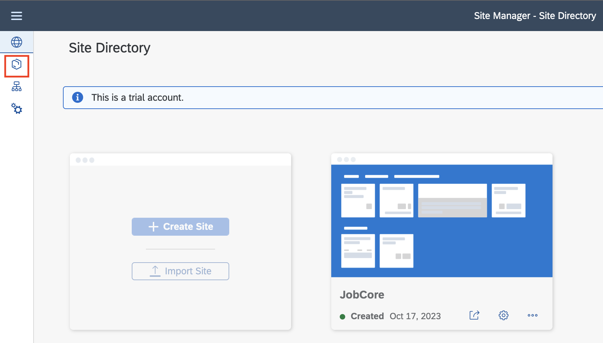

2. Click Create and select App from the list.

      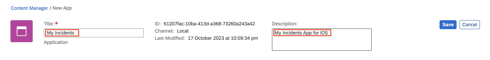

3. In the header of the app editor, enter a title `My Incidents` and description `My Incidents App for iOS`.

      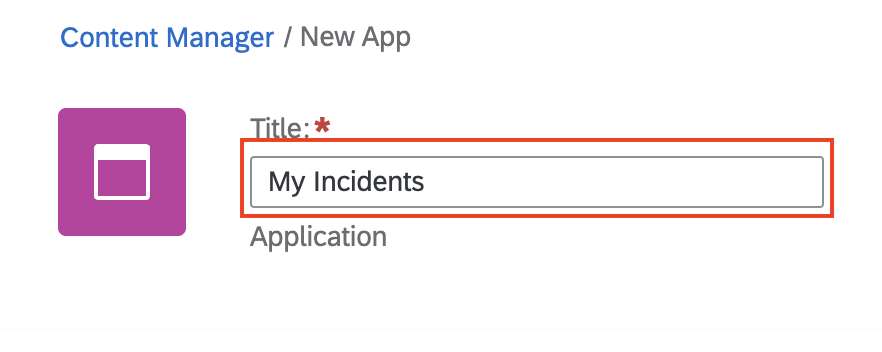

4. Under the Configuration tab, enter the following values:
      - Open App: `In Place`
      - System: `No System`
      - App UI Technology: `Native iOS`
      - URL to Launch App: `sapmobilesvcs://`
      - URL to Install App: `https://apps.apple.com/de/app/sap-mobile-services-client/id1413653544`

      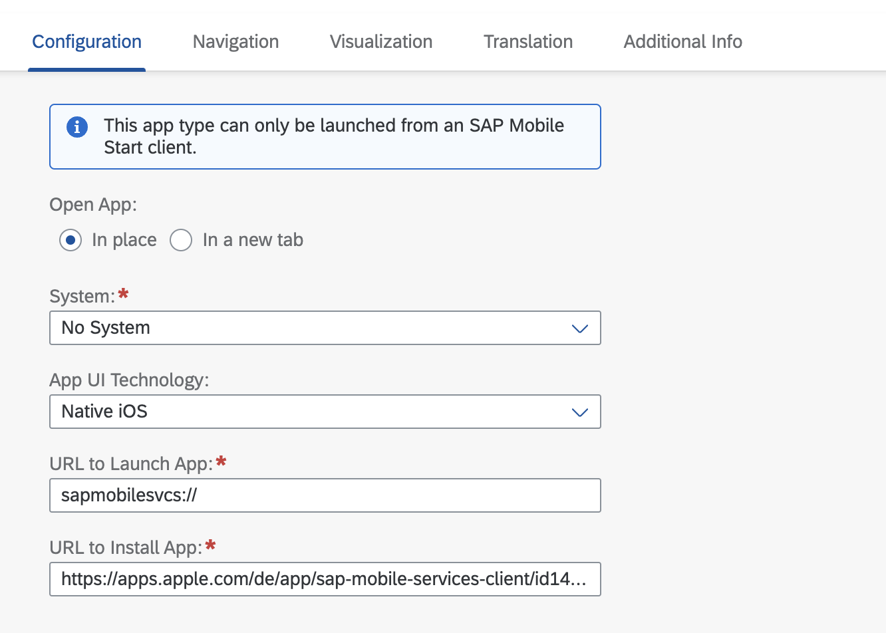

5. Under the Navigation tab, enter the following values, and click Save.
      - Semantic Object: `mdkios`
      - Action: `launch`

      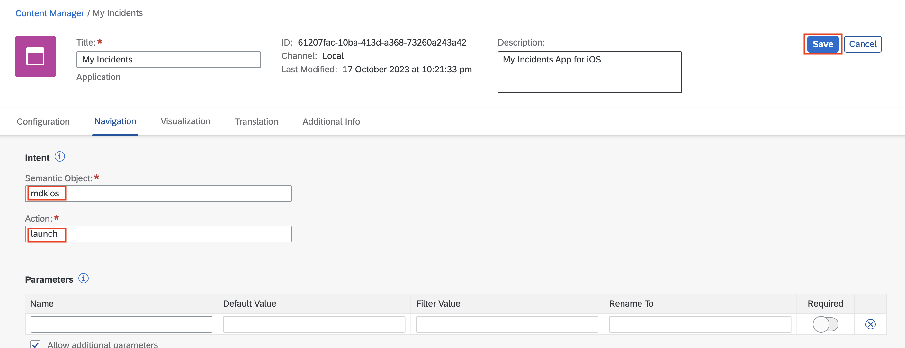

6. Click Create and select App from the list.

      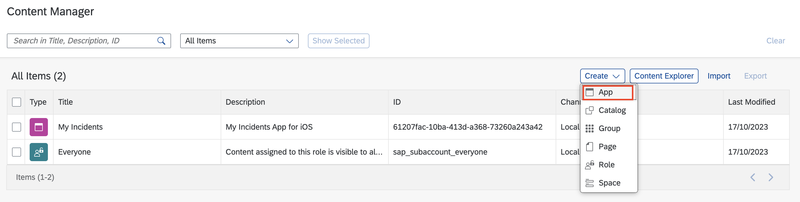

7. In the header of the app editor, enter a title `My Incidents` and description `My Incidents App for Android`.

      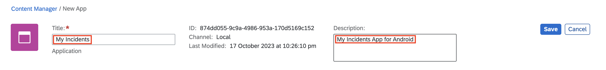

8. Under the Configuration tab, enter the following values:
      - Open App: `In Place`
      - System: `No System`
      - App UI Technology: `Native Android`
      - URL to Launch App: `sapmobilesvcs://`
      - URL to Install App: `https://play.google.com/store/apps/details?id=com.sap.mobileservices.client`

      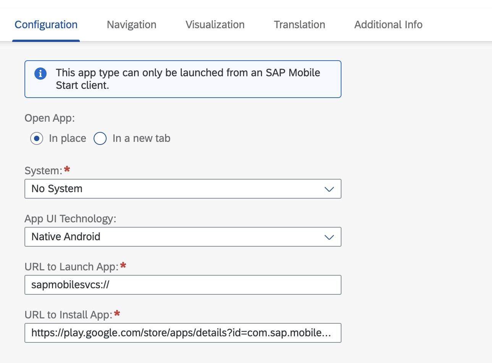

9.  Under the Navigation tab, enter the following values, and click Save.
      - Semantic Object: `mdkandroid`
      - Action: `launch`

      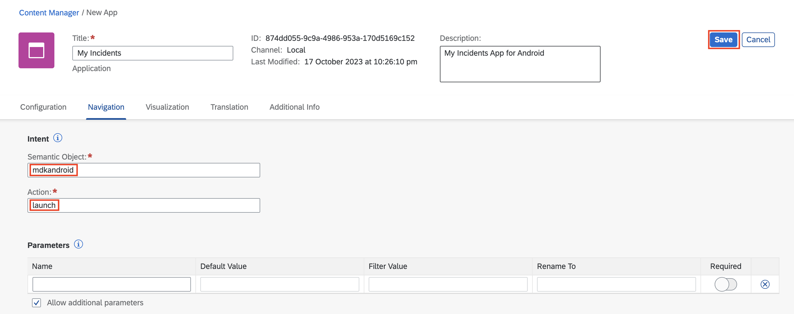

### Exercise 6.4 - Assign App Roles

1. Click Everyone

      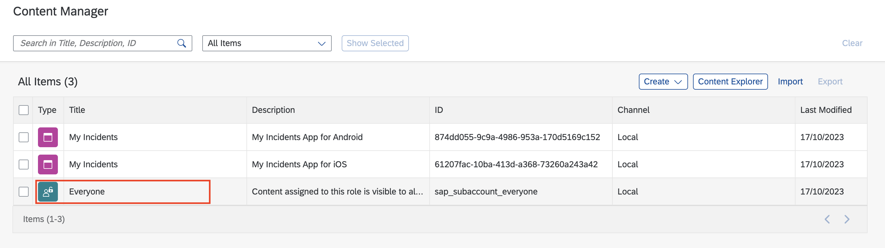

2. Click Edit

      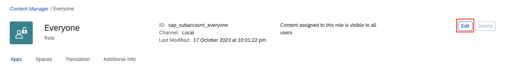

3. Enable the Assignment Status for the apps you created previously, and click Save.

      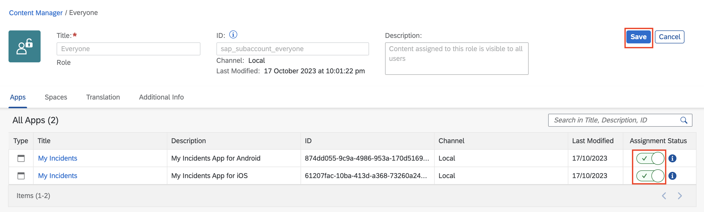

### Exercise 6.5 - Access Your Launchpad Site with SAP Mobile Start

1. Go back to the **Site Directory** and launch the prepared Site using the **launch** icon

      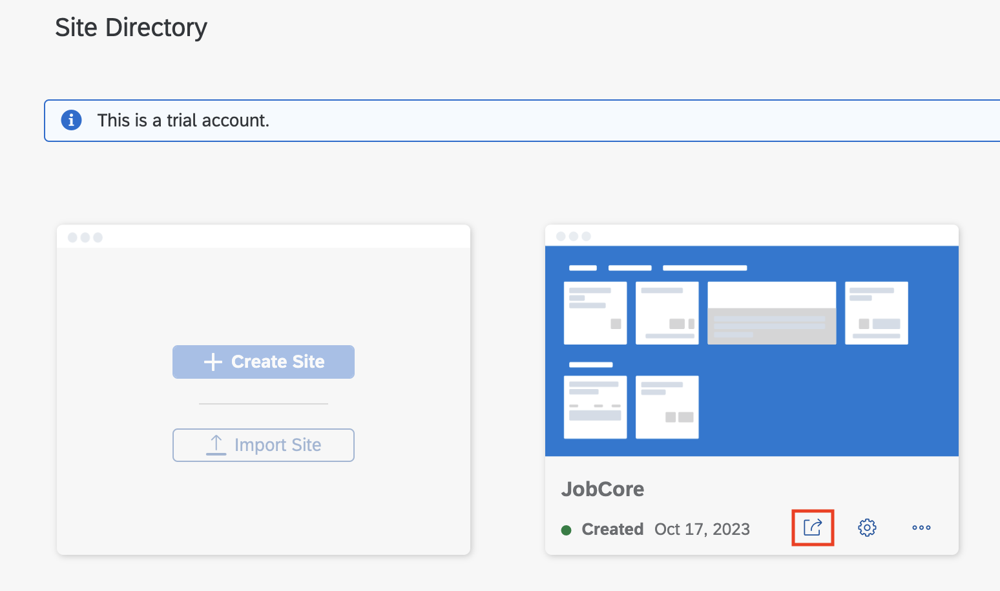

2. On the Site, go to **Profile** and open the **Settings** on the top left.

      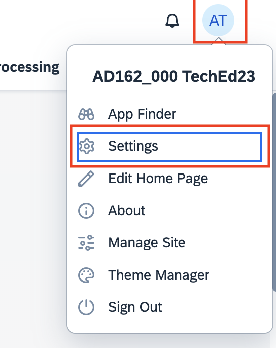

3. Navigate to the section **SAP Mobile Start Application** and select **Register** to show the QR-Code which can be used for onboarding.
   
   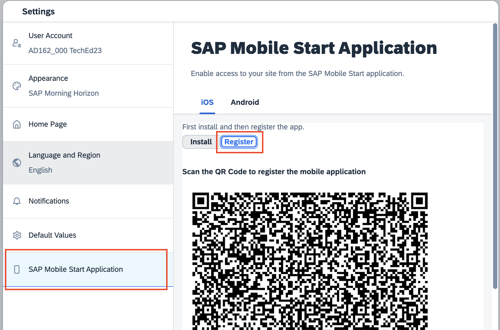

4. Open **SAP Mobile Start** on your mobile phone. If you don't have it yet, install it from the App Store or Google Play. You can use the following installation QRs to find it faster:

   

5.  Complete the onboarding process by providing your SAP BTP Trial credentials, setting a passcode and granting the necessary privileges.

6.  Tap on the **Apps** tab at the bottom tab bar. You can see the app integrating our mobile app built in this course under the section **AD162 Apps**

7.  Tapping on it will launch the **Mobile Services Client** in order to try out your app. If it is not yet installed, you will be redirected to the App Store or Google Play.

## Summary

You have learned how content integrated into SAP Build Work Zone, standard edition will appear in SAP Mobile Start. You experienced launching a native app from Mobile Start.

## Navigation
| Previous| Next |
|---|---|
| [Exercise 5](../ex4/README.md) | [Conclusion](../Conclusion.md) |